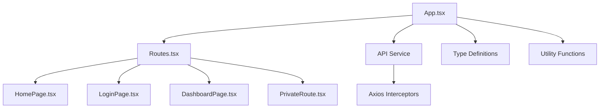
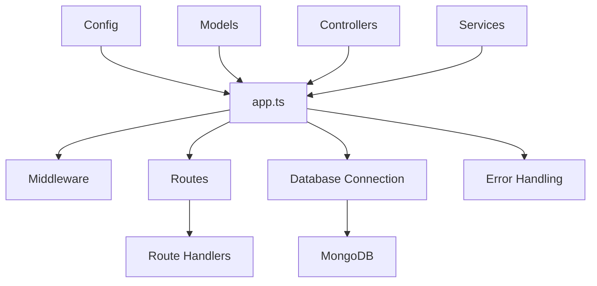
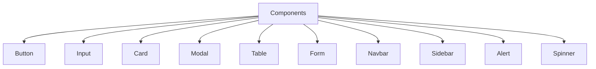
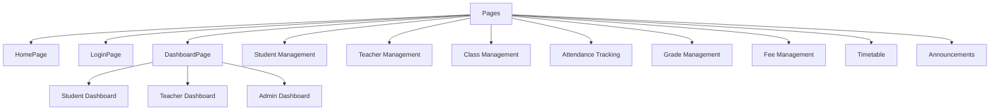
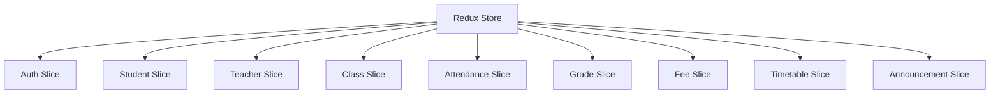
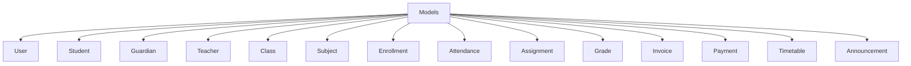
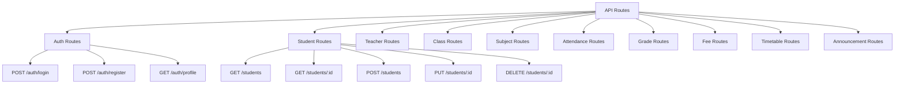
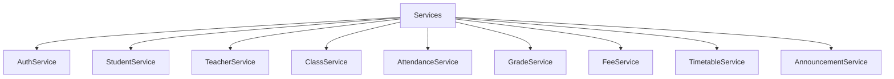

# School Management System - Comprehensive Architecture Plan

## 1. System Overview

The School Management System is a comprehensive web application built using the MERN stack (MongoDB, Express, React, Node.js) with TypeScript. It provides a robust platform for managing various aspects of a school, including student information, attendance tracking, grade management, fee processing, timetable scheduling, and communication through announcements.

## 2. Current Architecture Analysis

### 2.1 Frontend Structure


### 2.2 Backend Structure


## 3. Missing Components and Implementation Plan

### 3.1 Frontend Implementation

#### 3.1.1 Component Library
We need to implement a comprehensive component library:



#### 3.1.2 Page Components
We need to implement the following page components:



#### 3.1.3 State Management
We'll implement Redux Toolkit for state management:



### 3.2 Backend Implementation

#### 3.2.1 Database Models
We need to implement complete Mongoose models:



#### 3.2.2 API Endpoints
We need to implement comprehensive RESTful API endpoints:



#### 3.2.3 Service Layer
We'll implement a service layer for business logic:



## 4. Feature Implementation Roadmap

### 4.1 Phase 1: Core Authentication and User Management
- Implement User model with role-based access control
- Create authentication API endpoints
- Implement login and registration pages
- Create PrivateRoute component
- Implement role-based dashboard routing

### 4.2 Phase 2: Student and Teacher Management
- Implement Student and Teacher models
- Create CRUD API endpoints for students and teachers
- Implement student and teacher management pages
- Add enrollment functionality

### 4.3 Phase 3: Attendance Tracking System
- Implement Attendance model
- Create attendance tracking API endpoints
- Implement attendance tracking UI
- Add attendance reporting features

### 4.4 Phase 4: Grade Management System
- Implement Assignment and Grade models
- Create grade management API endpoints
- Implement grade book UI
- Add grade reporting features

### 4.5 Phase 5: Fee Management System
- Implement Invoice and Payment models
- Create fee management API endpoints
- Implement fee tracking UI
- Add payment processing features

### 4.6 Phase 6: Timetable Scheduling
- Implement Timetable model
- Create timetable API endpoints
- Implement timetable UI
- Add scheduling features

### 4.7 Phase 7: Communication System
- Implement Announcement model
- Create announcement API endpoints
- Implement announcement UI
- Add messaging features

## 5. Database Schema Design

### 5.1 User Schema
```typescript
interface User {
  id: string;
  username: string;
  email: string;
  password: string;
  role: 'admin' | 'teacher' | 'student' | 'guardian';
  createdAt: Date;
  updatedAt: Date;
}
```

### 5.2 Student Schema
```typescript
interface Student {
  id: string;
  firstName: string;
  lastName: string;
  dateOfBirth: Date;
  gender: string;
  address: string;
  contactNumber: string;
  guardianId: string;
  classId: string;
  enrollmentDate: Date;
  status: 'active' | 'inactive' | 'graduated';
}
```

### 5.3 Attendance Schema
```typescript
interface Attendance {
  id: string;
  studentId: string;
  classId: string;
  date: Date;
  status: 'present' | 'absent' | 'late';
  remarks: string;
}
```

## 6. API Design

### 6.1 Authentication Endpoints
- `POST /api/auth/login` - User login
- `POST /api/auth/register` - User registration
- `GET /api/auth/profile` - Get user profile
- `POST /api/auth/logout` - User logout

### 6.2 Student Endpoints
- `GET /api/students` - Get all students
- `GET /api/students/:id` - Get student by ID
- `POST /api/students` - Create new student
- `PUT /api/students/:id` - Update student
- `DELETE /api/students/:id` - Delete student

### 6.3 Attendance Endpoints
- `GET /api/attendance` - Get attendance records
- `GET /api/attendance/student/:studentId` - Get attendance by student
- `GET /api/attendance/class/:classId` - Get attendance by class
- `POST /api/attendance` - Record attendance
- `PUT /api/attendance/:id` - Update attendance record

## 7. Security Considerations

- Implement JWT-based authentication
- Use bcrypt for password hashing
- Implement role-based access control
- Add input validation and sanitization
- Implement rate limiting for API endpoints
- Use HTTPS in production
- Implement proper error handling without exposing sensitive information

## 8. Performance Optimization

- Implement database indexing for frequently queried fields
- Use pagination for large data sets
- Implement caching for frequently accessed data
- Optimize database queries
- Use code splitting for frontend bundles
- Implement lazy loading for components

## 9. Testing Strategy

- Unit tests for backend services and controllers
- Integration tests for API endpoints
- End-to-end tests for critical user flows
- UI component tests for frontend
- Performance tests for critical operations

## 10. Deployment Considerations

- Containerize application with Docker
- Implement CI/CD pipeline
- Use environment-specific configurations
- Implement logging and monitoring
- Set up automated backups for database
- Implement disaster recovery procedures