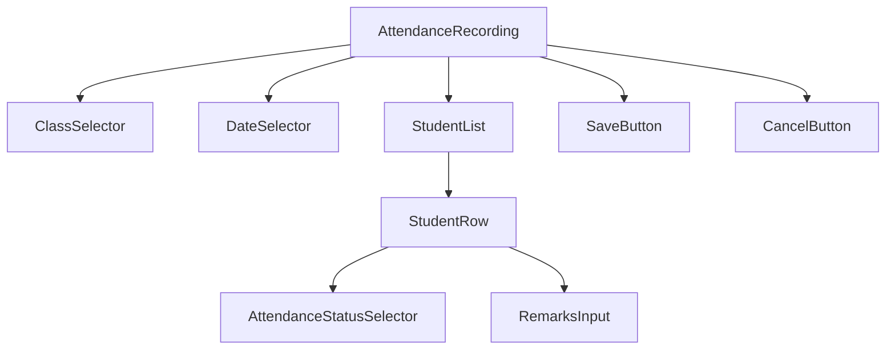
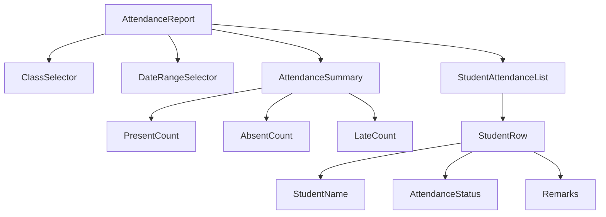

# Attendance Tracking Feature Plan

## 1. Feature Overview

The attendance tracking feature will allow teachers and administrators to record, view, and manage student attendance. This feature will include functionality for daily attendance recording, attendance reports, and analytics.

## 2. Database Model Design

### 2.1 Attendance Model
```typescript
interface Attendance {
  id: string;
  studentId: string;
  classId: string;
  date: Date;
  status: 'present' | 'absent' | 'late';
  remarks: string;
  recordedBy: string; // User ID of the teacher/admin who recorded attendance
  createdAt: Date;
  updatedAt: Date;
}
```

### 2.2 Database Schema (Mongoose)
```typescript
const attendanceSchema = new mongoose.Schema({
  studentId: {
    type: mongoose.Schema.Types.ObjectId,
    ref: 'Student',
    required: true
  },
  classId: {
    type: mongoose.Schema.Types.ObjectId,
    ref: 'Class',
    required: true
  },
  date: {
    type: Date,
    required: true
  },
  status: {
    type: String,
    enum: ['present', 'absent', 'late'],
    required: true
  },
  remarks: {
    type: String
  },
  recordedBy: {
    type: mongoose.Schema.Types.ObjectId,
    ref: 'User',
    required: true
  }
}, {
  timestamps: true
});
```

## 3. API Endpoints

### 3.1 Attendance Routes
```
GET    /api/attendance                    - Get all attendance records
GET    /api/attendance/:id                - Get attendance record by ID
GET    /api/attendance/student/:studentId - Get attendance by student
GET    /api/attendance/class/:classId     - Get attendance by class
GET    /api/attendance/date/:date         - Get attendance by date
POST   /api/attendance                    - Record attendance
PUT    /api/attendance/:id                - Update attendance record
DELETE /api/attendance/:id                - Delete attendance record
```

### 3.2 Request/Response Examples

#### Record Attendance (POST /api/attendance)
```json
// Request Body
{
  "studentId": "student123",
  "classId": "class456",
  "date": "2023-06-15",
  "status": "present",
  "remarks": "On time"
}

// Response
{
  "success": true,
  "data": {
    "id": "attendance789",
    "studentId": "student123",
    "classId": "class456",
    "date": "2023-06-15T00:00:00.000Z",
    "status": "present",
    "remarks": "On time",
    "recordedBy": "teacher123",
    "createdAt": "2023-06-15T08:30:00.000Z",
    "updatedAt": "2023-06-15T08:30:00.000Z"
  }
}
```

#### Get Attendance by Class (GET /api/attendance/class/:classId)
```json
// Response
{
  "success": true,
  "data": [
    {
      "id": "attendance789",
      "studentId": "student123",
      "classId": "class456",
      "date": "2023-06-15T00:00:00.000Z",
      "status": "present",
      "remarks": "On time",
      "recordedBy": "teacher123",
      "createdAt": "2023-06-15T08:30:00.000Z",
      "updatedAt": "2023-06-15T08:30:00.000Z"
    }
  ],
  "count": 1
}
```

## 4. Backend Implementation

### 4.1 Controller Functions
```typescript
// attendanceController.ts
class AttendanceController {
  // Get all attendance records
  async getAllAttendance(req: Request, res: Response) {
    // Implementation
  }

  // Get attendance by ID
  async getAttendanceById(req: Request, res: Response) {
    // Implementation
  }

  // Get attendance by student
  async getAttendanceByStudent(req: Request, res: Response) {
    // Implementation
  }

  // Get attendance by class
  async getAttendanceByClass(req: Request, res: Response) {
    // Implementation
  }

  // Record attendance
  async recordAttendance(req: Request, res: Response) {
    // Implementation
  }

  // Update attendance record
  async updateAttendance(req: Request, res: Response) {
    // Implementation
  }

  // Delete attendance record
  async deleteAttendance(req: Request, res: Response) {
    // Implementation
  }
}
```

### 4.2 Service Functions
```typescript
// attendanceService.ts
class AttendanceService {
  // Record attendance for multiple students
  async recordBulkAttendance(attendanceData: AttendanceRecord[]) {
    // Implementation
  }

  // Get attendance summary for a class
  async getClassAttendanceSummary(classId: string, startDate: Date, endDate: Date) {
    // Implementation
  }

  // Get attendance summary for a student
  async getStudentAttendanceSummary(studentId: string, startDate: Date, endDate: Date) {
    // Implementation
  }

  // Generate attendance report
  async generateAttendanceReport(classId: string, startDate: Date, endDate: Date) {
    // Implementation
  }
}
```

## 5. Frontend Implementation

### 5.1 UI Components

#### Attendance Recording Component


#### Attendance Report Component


### 5.2 Page Components

#### Attendance Dashboard Page
- Overview of attendance statistics
- Quick access to record attendance
- Recent attendance records
- Class-wise attendance summaries

#### Record Attendance Page
- Form for recording daily attendance
- Bulk attendance recording capability
- Validation for required fields

#### Attendance Reports Page
- Detailed attendance reports
- Export functionality (PDF, Excel)
- Filtering options (by date, class, student)

### 5.3 Redux State Management

#### Attendance Slice
```typescript
// attendanceSlice.ts
interface AttendanceState {
  attendanceRecords: Attendance[];
  loading: boolean;
  error: string | null;
  currentAttendance: Attendance | null;
  filters: {
    classId: string | null;
    date: Date | null;
    studentId: string | null;
  };
}

const attendanceSlice = createSlice({
  name: 'attendance',
  initialState,
  reducers: {
    setAttendanceRecords(state, action) {
      // Implementation
    },
    addAttendanceRecord(state, action) {
      // Implementation
    },
    updateAttendanceRecord(state, action) {
      // Implementation
    },
    deleteAttendanceRecord(state, action) {
      // Implementation
    },
    setLoading(state, action) {
      // Implementation
    },
    setError(state, action) {
      // Implementation
    }
  }
});
```

## 6. API Service Integration

### 6.1 Attendance API Service
```typescript
// attendanceApi.ts
class AttendanceApi {
  // Get all attendance records
  static async getAllAttendance() {
    return await api.get('/attendance');
  }

  // Record attendance
  static async recordAttendance(attendanceData: AttendanceRecord) {
    return await api.post('/attendance', attendanceData);
  }

  // Get attendance by class
  static async getAttendanceByClass(classId: string) {
    return await api.get(`/attendance/class/${classId}`);
  }

  // Update attendance record
  static async updateAttendance(id: string, attendanceData: Partial<Attendance>) {
    return await api.put(`/attendance/${id}`, attendanceData);
  }

  // Delete attendance record
  static async deleteAttendance(id: string) {
    return await api.delete(`/attendance/${id}`);
  }
}
```

## 7. Business Logic and Validation

### 7.1 Validation Rules
- Attendance can only be recorded for valid students and classes
- Attendance date cannot be in the future
- Each student can only have one attendance record per day per class
- Only teachers and admins can record attendance

### 7.2 Business Rules
- Calculate attendance percentage for students
- Generate attendance warnings for students with low attendance
- Prevent modification of attendance records older than 7 days (configurable)
- Audit trail for all attendance modifications

## 8. Reporting Features

### 8.1 Attendance Summary Reports
- Daily attendance summary
- Monthly attendance summary
- Class-wise attendance reports
- Student-wise attendance reports

### 8.2 Export Options
- PDF export of attendance reports
- Excel export of attendance data
- CSV export for importing into other systems

## 9. Security Considerations

- Role-based access control (only teachers and admins can record attendance)
- Input validation and sanitization
- Rate limiting for API endpoints
- Audit logging for all attendance operations

## 10. Performance Optimization

- Database indexing on frequently queried fields (studentId, classId, date)
- Pagination for large attendance record sets
- Caching of frequently accessed attendance summaries
- Efficient querying for attendance reports