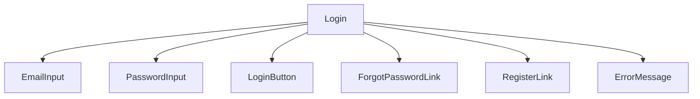
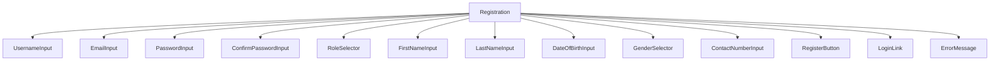
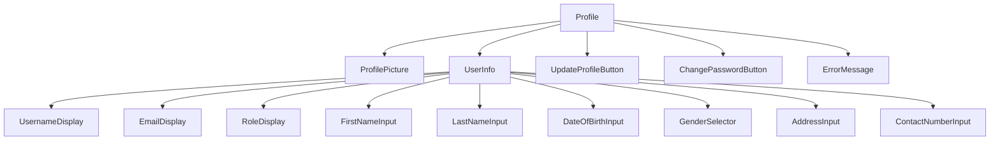

# Authentication System with Role-Based Access Control Plan

## 1. Feature Overview

The authentication system will provide secure user authentication and authorization with role-based access control. It will support multiple user roles (admin, teacher, student, guardian) with different permissions and access levels.

## 2. Database Model Design

### 2.1 User Model
```typescript
interface User {
  id: string;
  username: string;
  email: string;
  password: string;
  role: 'admin' | 'teacher' | 'student' | 'guardian';
  firstName: string;
  lastName: string;
  dateOfBirth: Date;
  gender: string;
  address: string;
  contactNumber: string;
  profilePicture: string;
  isActive: boolean;
  lastLogin: Date;
  createdAt: Date;
  updatedAt: Date;
}
```

### 2.2 Database Schema (Mongoose)
```typescript
const userSchema = new mongoose.Schema({
  username: {
    type: String,
    required: true,
    unique: true,
    trim: true,
    minlength: 3,
    maxlength: 30
  },
  email: {
    type: String,
    required: true,
    unique: true,
    trim: true,
    lowercase: true,
    match: [/^\w+([.-]?\w+)*@\w+([.-]?\w+)*(\.\w{2,3})+$/, 'Invalid email address']
  },
  password: {
    type: String,
    required: true,
    minlength: 6
  },
  role: {
    type: String,
    enum: ['admin', 'teacher', 'student', 'guardian'],
    default: 'student'
  },
  firstName: {
    type: String,
    required: true,
    trim: true
  },
  lastName: {
    type: String,
    required: true,
    trim: true
  },
  dateOfBirth: {
    type: Date
  },
  gender: {
    type: String,
    enum: ['male', 'female', 'other']
  },
  address: {
    type: String
  },
  contactNumber: {
    type: String
  },
  profilePicture: {
    type: String
  },
  isActive: {
    type: Boolean,
    default: true
  },
  lastLogin: {
    type: Date
  }
}, {
  timestamps: true
});

// Hash password before saving
userSchema.pre('save', async function(next) {
  if (!this.isModified('password')) return next();
  this.password = await bcrypt.hash(this.password, 12);
  next();
});

// Compare password method
userSchema.methods.comparePassword = async function(candidatePassword: string) {
  return await bcrypt.compare(candidatePassword, this.password);
};

// Remove password from JSON output
userSchema.methods.toJSON = function() {
  const userObject = this.toObject();
  delete userObject.password;
  return userObject;
};
```

## 3. API Endpoints

### 3.1 Authentication Routes
```
POST   /api/auth/register        - User registration
POST   /api/auth/login           - User login
POST   /api/auth/logout          - User logout
GET    /api/auth/profile         - Get user profile
PUT    /api/auth/profile         - Update user profile
PUT    /api/auth/password        - Change password
POST   /api/auth/forgot-password - Forgot password
POST   /api/auth/reset-password  - Reset password
```

### 3.2 Request/Response Examples

#### User Registration (POST /api/auth/register)
```json
// Request Body
{
  "username": "johndoe",
  "email": "john.doe@example.com",
  "password": "securepassword123",
  "role": "student",
  "firstName": "John",
  "lastName": "Doe",
  "dateOfBirth": "2005-05-15",
  "gender": "male",
  "contactNumber": "+1234567890"
}

// Response
{
  "success": true,
  "data": {
    "user": {
      "id": "user123",
      "username": "johndoe",
      "email": "john.doe@example.com",
      "role": "student",
      "firstName": "John",
      "lastName": "Doe",
      "dateOfBirth": "2005-05-15T00:00:00.000Z",
      "gender": "male",
      "contactNumber": "+1234567890",
      "isActive": true,
      "createdAt": "2023-06-15T08:30:00.000Z",
      "updatedAt": "2023-06-15T08:30:00.000Z"
    },
    "token": "eyJhbGciOiJIUzI1NiIsInR5cCI6IkpXVCJ9..."
  }
}
```

#### User Login (POST /api/auth/login)
```json
// Request Body
{
  "email": "john.doe@example.com",
  "password": "securepassword123"
}

// Response
{
  "success": true,
  "data": {
    "user": {
      "id": "user123",
      "username": "johndoe",
      "email": "john.doe@example.com",
      "role": "student",
      "firstName": "John",
      "lastName": "Doe",
      "isActive": true,
      "lastLogin": "2023-06-15T08:30:00.000Z"
    },
    "token": "eyJhbGciOiJIUzI1NiIsInR5cCI6IkpXVCJ9..."
  }
}
```

## 4. Backend Implementation

### 4.1 Authentication Controller
```typescript
// authController.ts
class AuthController {
  // User registration
  async register(req: Request, res: Response) {
    try {
      const { username, email, password, role, firstName, lastName, dateOfBirth, gender, contactNumber } = req.body;
      
      // Check if user already exists
      const existingUser = await User.findOne({ 
        $or: [{ email }, { username }] 
      });
      
      if (existingUser) {
        return res.status(400).json({
          success: false,
          message: 'User with this email or username already exists'
        });
      }
      
      // Create new user
      const user = new User({
        username,
        email,
        password,
        role,
        firstName,
        lastName,
        dateOfBirth,
        gender,
        contactNumber
      });
      
      await user.save();
      
      // Generate JWT token
      const token = jwt.sign(
        { userId: user.id, role: user.role },
        config.jwtSecret,
        { expiresIn: config.jwtExpiration }
      );
      
      // Update last login
      user.lastLogin = new Date();
      await user.save();
      
      res.status(201).json({
        success: true,
        data: {
          user: user.toJSON(),
          token
        }
      });
    } catch (error) {
      res.status(500).json({
        success: false,
        message: 'Internal server error'
      });
    }
  }

  // User login
  async login(req: Request, res: Response) {
    try {
      const { email, password } = req.body;
      
      // Find user by email
      const user = await User.findOne({ email });
      if (!user) {
        return res.status(401).json({
          success: false,
          message: 'Invalid email or password'
        });
      }
      
      // Check if user is active
      if (!user.isActive) {
        return res.status(401).json({
          success: false,
          message: 'Account is deactivated'
        });
      }
      
      // Validate password
      const isPasswordValid = await user.comparePassword(password);
      if (!isPasswordValid) {
        return res.status(401).json({
          success: false,
          message: 'Invalid email or password'
        });
      }
      
      // Generate JWT token
      const token = jwt.sign(
        { userId: user.id, role: user.role },
        config.jwtSecret,
        { expiresIn: config.jwtExpiration }
      );
      
      // Update last login
      user.lastLogin = new Date();
      await user.save();
      
      res.status(200).json({
        success: true,
        data: {
          user: user.toJSON(),
          token
        }
      });
    } catch (error) {
      res.status(500).json({
        success: false,
        message: 'Internal server error'
      });
    }
  }

  // Get user profile
  async getProfile(req: Request, res: Response) {
    try {
      const user = await User.findById(req.userId);
      if (!user) {
        return res.status(404).json({
          success: false,
          message: 'User not found'
        });
      }
      
      res.status(200).json({
        success: true,
        data: {
          user: user.toJSON()
        }
      });
    } catch (error) {
      res.status(500).json({
        success: false,
        message: 'Internal server error'
      });
    }
  }

  // Update user profile
  async updateProfile(req: Request, res: Response) {
    try {
      const { firstName, lastName, dateOfBirth, gender, address, contactNumber, profilePicture } = req.body;
      
      const user = await User.findByIdAndUpdate(
        req.userId,
        { firstName, lastName, dateOfBirth, gender, address, contactNumber, profilePicture },
        { new: true, runValidators: true }
      );
      
      if (!user) {
        return res.status(404).json({
          success: false,
          message: 'User not found'
        });
      }
      
      res.status(200).json({
        success: true,
        data: {
          user: user.toJSON()
        }
      });
    } catch (error) {
      res.status(500).json({
        success: false,
        message: 'Internal server error'
      });
    }
  }

  // Change password
  async changePassword(req: Request, res: Response) {
    try {
      const { currentPassword, newPassword } = req.body;
      
      const user = await User.findById(req.userId);
      if (!user) {
        return res.status(404).json({
          success: false,
          message: 'User not found'
        });
      }
      
      // Validate current password
      const isPasswordValid = await user.comparePassword(currentPassword);
      if (!isPasswordValid) {
        return res.status(401).json({
          success: false,
          message: 'Current password is incorrect'
        });
      }
      
      // Update password
      user.password = newPassword;
      await user.save();
      
      res.status(200).json({
        success: true,
        message: 'Password changed successfully'
      });
    } catch (error) {
      res.status(500).json({
        success: false,
        message: 'Internal server error'
      });
    }
  }
}
```

### 4.2 Authentication Middleware
```typescript
// authMiddleware.ts
class AuthMiddleware {
  // Verify JWT token
  static async verifyToken(req: Request, res: Response, next: NextFunction) {
    try {
      const token = req.header('Authorization')?.replace('Bearer ', '');
      
      if (!token) {
        return res.status(401).json({
          success: false,
          message: 'Access denied. No token provided.'
        });
      }
      
      const decoded = jwt.verify(token, config.jwtSecret) as { userId: string; role: string };
      req.userId = decoded.userId;
      req.userRole = decoded.role;
      
      next();
    } catch (error) {
      res.status(401).json({
        success: false,
        message: 'Invalid token'
      });
    }
  }

  // Role-based authorization
  static authorizeRoles(...roles: string[]) {
    return (req: Request, res: Response, next: NextFunction) => {
      if (!roles.includes(req.userRole)) {
        return res.status(403).json({
          success: false,
          message: 'Access denied. Insufficient permissions.'
        });
      }
      next();
    };
  }
}
```

## 5. Frontend Implementation

### 5.1 UI Components

#### Login Component


#### Registration Component


#### Profile Component


### 5.2 Page Components

#### Authentication Pages
- Login Page
- Registration Page
- Forgot Password Page
- Reset Password Page

#### Profile Pages
- User Profile Page
- Edit Profile Page
- Change Password Page

### 5.3 Redux State Management

#### Auth Slice
```typescript
// authSlice.ts
interface AuthState {
  user: User | null;
  token: string | null;
  isAuthenticated: boolean;
  loading: boolean;
  error: string | null;
}

const authSlice = createSlice({
  name: 'auth',
  initialState,
  reducers: {
    setUser(state, action) {
      state.user = action.payload.user;
      state.token = action.payload.token;
      state.isAuthenticated = true;
    },
    clearUser(state) {
      state.user = null;
      state.token = null;
      state.isAuthenticated = false;
    },
    setLoading(state, action) {
      state.loading = action.payload;
    },
    setError(state, action) {
      state.error = action.payload;
    }
  }
});

// Async thunks
export const login = createAsyncThunk(
  'auth/login',
  async (credentials: { email: string; password: string }, { rejectWithValue }) => {
    try {
      const response = await authApi.login(credentials);
      return response.data;
    } catch (error) {
      return rejectWithValue(error.response.data.message);
    }
  }
);

export const register = createAsyncThunk(
  'auth/register',
  async (userData: RegisterData, { rejectWithValue }) => {
    try {
      const response = await authApi.register(userData);
      return response.data;
    } catch (error) {
      return rejectWithValue(error.response.data.message);
    }
  }
);

export const getProfile = createAsyncThunk(
  'auth/getProfile',
  async (_, { getState, rejectWithValue }) => {
    try {
      const { auth } = getState() as RootState;
      const response = await authApi.getProfile(auth.token);
      return response.data.user;
    } catch (error) {
      return rejectWithValue(error.response.data.message);
    }
  }
);
```

## 6. API Service Integration

### 6.1 Authentication API Service
```typescript
// authApi.ts
class AuthApi {
  // User login
  static async login(credentials: { email: string; password: string }) {
    return await api.post('/auth/login', credentials);
  }

  // User registration
  static async register(userData: RegisterData) {
    return await api.post('/auth/register', userData);
  }

  // Get user profile
  static async getProfile(token: string) {
    return await api.get('/auth/profile', {
      headers: { Authorization: `Bearer ${token}` }
    });
  }

  // Update user profile
  static async updateProfile(profileData: Partial<User>, token: string) {
    return await api.put('/auth/profile', profileData, {
      headers: { Authorization: `Bearer ${token}` }
    });
  }

  // Change password
  static async changePassword(passwordData: { currentPassword: string; newPassword: string }, token: string) {
    return await api.put('/auth/password', passwordData, {
      headers: { Authorization: `Bearer ${token}` }
    });
  }

  // Forgot password
  static async forgotPassword(email: string) {
    return await api.post('/auth/forgot-password', { email });
  }

  // Reset password
  static async resetPassword(resetData: { token: string; newPassword: string }) {
    return await api.post('/auth/reset-password', resetData);
  }
}
```

## 7. Role-Based Access Control Implementation

### 7.1 Role Permissions Matrix
| Role | Dashboard Access | Student Management | Teacher Management | Class Management | Attendance | Grades | Fees | Timetable | Announcements |
|------|------------------|-------------------|-------------------|------------------|------------|--------|------|-----------|---------------|
| Admin | Full | Full | Full | Full | Full | Full | Full | Full | Full |
| Teacher | Limited | Read-only | None | Limited | Full | Full | Read-only | Full | Limited |
| Student | Limited | None | None | None | Read-only | Read-only | Read-only | Read-only | Read-only |
| Guardian | Limited | Read-only (own child) | None | None | Read-only (own child) | Read-only (own child) | Read-only (own child) | Read-only (own child) | Read-only (own child) |

### 7.2 Route Protection
```typescript
// Protected Routes Configuration
const protectedRoutes = [
  {
    path: '/dashboard',
    component: DashboardPage,
    roles: ['admin', 'teacher', 'student', 'guardian']
  },
  {
    path: '/students',
    component: StudentManagementPage,
    roles: ['admin']
  },
  {
    path: '/teachers',
    component: TeacherManagementPage,
    roles: ['admin']
  },
  {
    path: '/attendance',
    component: AttendancePage,
    roles: ['admin', 'teacher']
  },
  {
    path: '/grades',
    component: GradeManagementPage,
    roles: ['admin', 'teacher']
  }
];
```

## 8. Security Considerations

### 8.1 Password Security
- Use bcrypt for password hashing with salt rounds >= 12
- Enforce strong password policies (min length, complexity)
- Implement rate limiting for login attempts
- Lock accounts after multiple failed attempts

### 8.2 Token Security
- Use JWT with secure signing
- Implement token expiration and refresh mechanism
- Store tokens securely (HttpOnly cookies for web)
- Validate tokens on all protected routes

### 8.3 Data Protection
- Encrypt sensitive data at rest
- Use HTTPS for all communications
- Implement proper input validation and sanitization
- Sanitize output to prevent XSS attacks

## 9. Business Logic and Validation

### 9.1 Registration Validation Rules
- Email must be unique
- Username must be unique and 3-30 characters
- Password must be at least 6 characters
- Role must be one of the allowed values
- Required fields must be provided

### 9.2 Login Validation Rules
- Email must exist in the system
- Password must match the stored hash
- Account must be active
- Implement rate limiting for failed attempts

## 10. Performance Optimization

### 10.1 Database Indexing
- Index on email and username for fast lookups
- Index on role for role-based queries
- Compound index on email and password for login queries

### 10.2 Caching
- Cache user profile data for authenticated users
- Cache role permissions to avoid repeated database queries
- Use Redis for session storage in production

## 11. Testing Strategy

### 11.1 Unit Tests
- Test password hashing and validation
- Test JWT token generation and verification
- Test role-based authorization logic
- Test input validation functions

### 11.2 Integration Tests
- Test complete registration flow
- Test complete login flow
- Test protected route access with different roles
- Test profile update functionality

### 11.3 Security Tests
- Test password strength enforcement
- Test rate limiting implementation
- Test token expiration and refresh
- Test SQL injection and XSS prevention