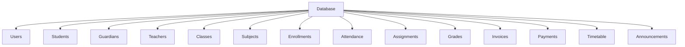
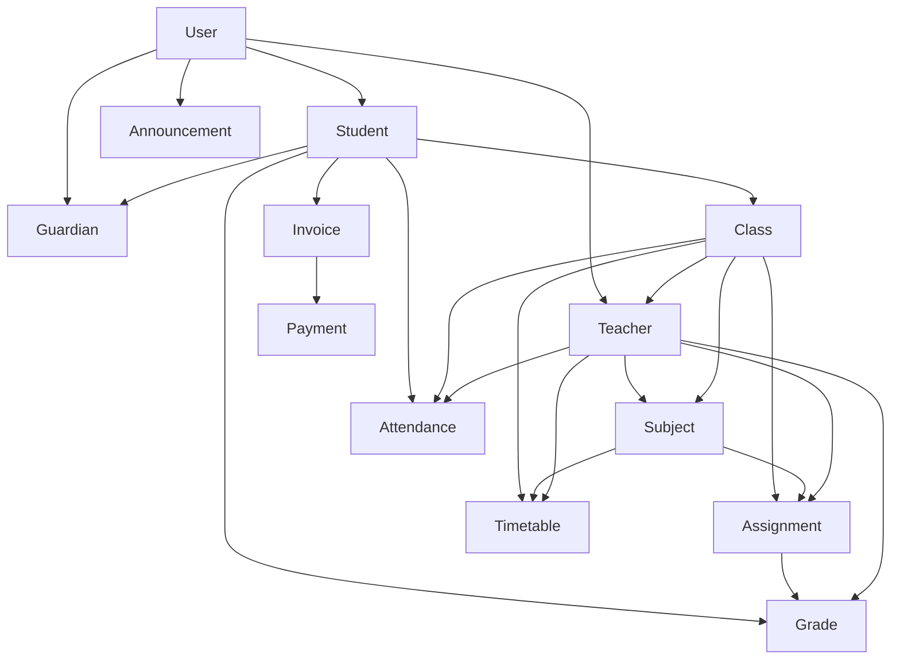

# Database Models Plan

## 1. Overview

This document outlines the complete database schema design for the school management system using MongoDB with Mongoose. Each model includes field definitions, relationships, and implementation notes.

## 2. Database Structure

### 2.1 Collections


### 2.2 Relationships


## 3. User Model

### 3.1 Schema Definition
```typescript
// models/User.ts
import mongoose, { Schema, Document } from 'mongoose';
import bcrypt from 'bcryptjs';

export interface IUser extends Document {
  username: string;
  email: string;
  password: string;
  role: 'admin' | 'teacher' | 'student' | 'guardian';
  firstName: string;
  lastName: string;
  dateOfBirth: Date;
  gender: 'male' | 'female' | 'other';
  address: string;
  contactNumber: string;
  profilePicture: string;
  isActive: boolean;
  lastLogin: Date;
  createdAt: Date;
  updatedAt: Date;
}

const userSchema: Schema = new Schema({
  username: {
    type: String,
    required: true,
    unique: true,
    trim: true,
    minlength: 3,
    maxlength: 30
  },
  email: {
    type: String,
    required: true,
    unique: true,
    trim: true,
    lowercase: true,
    validate: {
      validator: function(v: string) {
        return /^\w+([.-]?\w+)*@\w+([.-]?\w+)*(\.\w{2,3})+$/.test(v);
      },
      message: 'Please enter a valid email'
    }
  },
  password: {
    type: String,
    required: true,
    minlength: 6
  },
  role: {
    type: String,
    required: true,
    enum: ['admin', 'teacher', 'student', 'guardian']
  },
  firstName: {
    type: String,
    required: true,
    trim: true
  },
  lastName: {
    type: String,
    required: true,
    trim: true
  },
  dateOfBirth: {
    type: Date,
    required: false
  },
  gender: {
    type: String,
    required: false,
    enum: ['male', 'female', 'other']
  },
  address: {
    type: String,
    required: false
  },
  contactNumber: {
    type: String,
    required: false
  },
  profilePicture: {
    type: String,
    required: false
  },
  isActive: {
    type: Boolean,
    default: true
  },
  lastLogin: {
    type: Date,
    required: false
  }
}, {
  timestamps: true
});

// Hash password before saving
userSchema.pre('save', async function(next) {
  if (!this.isModified('password')) return next();
  
  try {
    const salt = await bcrypt.genSalt(10);
    this.password = await bcrypt.hash(this.password, salt);
    next();
  } catch (error) {
    next(error);
  }
});

// Compare password method
userSchema.methods.comparePassword = async function(candidatePassword: string) {
  return await bcrypt.compare(candidatePassword, this.password);
};

export default mongoose.model<IUser>('User', userSchema);
```

## 4. Student Model

### 4.1 Schema Definition
```typescript
// models/Student.ts
import mongoose, { Schema, Document } from 'mongoose';

export interface IStudent extends Document {
  firstName: string;
  lastName: string;
  dateOfBirth: Date;
  gender: 'male' | 'female' | 'other';
  address: string;
  contactNumber: string;
  guardianId: mongoose.Types.ObjectId;
  classId: mongoose.Types.ObjectId;
  enrollmentDate: Date;
  status: 'active' | 'inactive' | 'graduated';
  userId: mongoose.Types.ObjectId;
  createdAt: Date;
  updatedAt: Date;
}

const studentSchema: Schema = new Schema({
  firstName: {
    type: String,
    required: true,
    trim: true
  },
  lastName: {
    type: String,
    required: true,
    trim: true
  },
  dateOfBirth: {
    type: Date,
    required: true
  },
  gender: {
    type: String,
    required: true,
    enum: ['male', 'female', 'other']
  },
  address: {
    type: String,
    required: false
  },
  contactNumber: {
    type: String,
    required: false
  },
  guardianId: {
    type: Schema.Types.ObjectId,
    ref: 'Guardian',
    required: true
  },
  classId: {
    type: Schema.Types.ObjectId,
    ref: 'Class',
    required: false
  },
  enrollmentDate: {
    type: Date,
    default: Date.now
  },
  status: {
    type: String,
    default: 'active',
    enum: ['active', 'inactive', 'graduated']
  },
  userId: {
    type: Schema.Types.ObjectId,
    ref: 'User',
    required: true
  }
}, {
  timestamps: true
});

// Indexes for better query performance
studentSchema.index({ classId: 1 });
studentSchema.index({ guardianId: 1 });
studentSchema.index({ status: 1 });

export default mongoose.model<IStudent>('Student', studentSchema);
```

## 5. Guardian Model

### 5.1 Schema Definition
```typescript
// models/Guardian.ts
import mongoose, { Schema, Document } from 'mongoose';

export interface IGuardian extends Document {
  firstName: string;
  lastName: string;
  relationship: string;
  contactNumber: string;
  email: string;
  address: string;
  userId: mongoose.Types.ObjectId;
  createdAt: Date;
  updatedAt: Date;
}

const guardianSchema: Schema = new Schema({
  firstName: {
    type: String,
    required: true,
    trim: true
  },
  lastName: {
    type: String,
    required: true,
    trim: true
  },
  relationship: {
    type: String,
    required: true,
    trim: true
  },
  contactNumber: {
    type: String,
    required: true
  },
  email: {
    type: String,
    required: false,
    trim: true,
    lowercase: true
  },
  address: {
    type: String,
    required: false
  },
  userId: {
    type: Schema.Types.ObjectId,
    ref: 'User',
    required: true
  }
}, {
  timestamps: true
});

// Indexes for better query performance
guardianSchema.index({ email: 1 });

export default mongoose.model<IGuardian>('Guardian', guardianSchema);
```

## 6. Teacher Model

### 6.1 Schema Definition
```typescript
// models/Teacher.ts
import mongoose, { Schema, Document } from 'mongoose';

export interface ITeacher extends Document {
  firstName: string;
  lastName: string;
  dateOfBirth: Date;
  gender: 'male' | 'female' | 'other';
  address: string;
  contactNumber: string;
  subjectId: mongoose.Types.ObjectId;
  hireDate: Date;
  qualification: string;
  status: 'active' | 'inactive';
  userId: mongoose.Types.ObjectId;
  createdAt: Date;
  updatedAt: Date;
}

const teacherSchema: Schema = new Schema({
  firstName: {
    type: String,
    required: true,
    trim: true
  },
  lastName: {
    type: String,
    required: true,
    trim: true
  },
  dateOfBirth: {
    type: Date,
    required: true
  },
  gender: {
    type: String,
    required: true,
    enum: ['male', 'female', 'other']
  },
  address: {
    type: String,
    required: false
  },
  contactNumber: {
    type: String,
    required: true
  },
  subjectId: {
    type: Schema.Types.ObjectId,
    ref: 'Subject',
    required: true
  },
  hireDate: {
    type: Date,
    default: Date.now
  },
  qualification: {
    type: String,
    required: true
  },
  status: {
    type: String,
    default: 'active',
    enum: ['active', 'inactive']
  },
  userId: {
    type: Schema.Types.ObjectId,
    ref: 'User',
    required: true
  }
}, {
  timestamps: true
});

// Indexes for better query performance
teacherSchema.index({ subjectId: 1 });
teacherSchema.index({ status: 1 });

export default mongoose.model<ITeacher>('Teacher', teacherSchema);
```

## 7. Class Model

### 7.1 Schema Definition
```typescript
// models/Class.ts
import mongoose, { Schema, Document } from 'mongoose';

export interface IClass extends Document {
  name: string;
  description: string;
  teacherId: mongoose.Types.ObjectId;
  subjectId: mongoose.Types.ObjectId;
  startDate: Date;
  endDate: Date;
  capacity: number;
  status: 'active' | 'inactive';
  createdAt: Date;
  updatedAt: Date;
}

const classSchema: Schema = new Schema({
  name: {
    type: String,
    required: true,
    trim: true
  },
  description: {
    type: String,
    required: false
  },
  teacherId: {
    type: Schema.Types.ObjectId,
    ref: 'Teacher',
    required: true
  },
  subjectId: {
    type: Schema.Types.ObjectId,
    ref: 'Subject',
    required: true
  },
  startDate: {
    type: Date,
    required: true
  },
  endDate: {
    type: Date,
    required: true
  },
  capacity: {
    type: Number,
    required: true,
    min: 1,
    max: 100
  },
  status: {
    type: String,
    default: 'active',
    enum: ['active', 'inactive']
  }
}, {
  timestamps: true
});

// Indexes for better query performance
classSchema.index({ teacherId: 1 });
classSchema.index({ subjectId: 1 });
classSchema.index({ status: 1 });

export default mongoose.model<IClass>('Class', classSchema);
```

## 8. Subject Model

### 8.1 Schema Definition
```typescript
// models/Subject.ts
import mongoose, { Schema, Document } from 'mongoose';

export interface ISubject extends Document {
  name: string;
  code: string;
  description: string;
  credits: number;
  createdAt: Date;
  updatedAt: Date;
}

const subjectSchema: Schema = new Schema({
  name: {
    type: String,
    required: true,
    unique: true,
    trim: true
  },
  code: {
    type: String,
    required: true,
    unique: true,
    trim: true
  },
  description: {
    type: String,
    required: false
  },
  credits: {
    type: Number,
    required: true,
    min: 1,
    max: 10
  }
}, {
  timestamps: true
});

// Indexes for better query performance
subjectSchema.index({ code: 1 });

export default mongoose.model<ISubject>('Subject', subjectSchema);
```

## 9. Enrollment Model

### 9.1 Schema Definition
```typescript
// models/Enrollment.ts
import mongoose, { Schema, Document } from 'mongoose';

export interface IEnrollment extends Document {
  studentId: mongoose.Types.ObjectId;
  classId: mongoose.Types.ObjectId;
  enrollmentDate: Date;
  status: 'enrolled' | 'dropped' | 'completed';
  createdAt: Date;
  updatedAt: Date;
}

const enrollmentSchema: Schema = new Schema({
  studentId: {
    type: Schema.Types.ObjectId,
    ref: 'Student',
    required: true
  },
  classId: {
    type: Schema.Types.ObjectId,
    ref: 'Class',
    required: true
  },
  enrollmentDate: {
    type: Date,
    default: Date.now
  },
  status: {
    type: String,
    default: 'enrolled',
    enum: ['enrolled', 'dropped', 'completed']
  }
}, {
  timestamps: true
});

// Indexes for better query performance
enrollmentSchema.index({ studentId: 1 });
enrollmentSchema.index({ classId: 1 });
enrollmentSchema.index({ status: 1 });

// Compound index for unique enrollment constraint
enrollmentSchema.index({ studentId: 1, classId: 1 }, { unique: true });

export default mongoose.model<IEnrollment>('Enrollment', enrollmentSchema);
```

## 10. Attendance Model

### 10.1 Schema Definition
```typescript
// models/Attendance.ts
import mongoose, { Schema, Document } from 'mongoose';

export interface IAttendance extends Document {
  studentId: mongoose.Types.ObjectId;
  classId: mongoose.Types.ObjectId;
  date: Date;
  status: 'present' | 'absent' | 'late';
  remarks: string;
  recordedBy: mongoose.Types.ObjectId;
  createdAt: Date;
  updatedAt: Date;
}

const attendanceSchema: Schema = new Schema({
  studentId: {
    type: Schema.Types.ObjectId,
    ref: 'Student',
    required: true
  },
  classId: {
    type: Schema.Types.ObjectId,
    ref: 'Class',
    required: true
  },
  date: {
    type: Date,
    required: true
  },
  status: {
    type: String,
    required: true,
    enum: ['present', 'absent', 'late']
  },
  remarks: {
    type: String,
    required: false
  },
  recordedBy: {
    type: Schema.Types.ObjectId,
    ref: 'User',
    required: true
  }
}, {
  timestamps: true
});

// Indexes for better query performance
attendanceSchema.index({ studentId: 1 });
attendanceSchema.index({ classId: 1 });
attendanceSchema.index({ date: 1 });
attendanceSchema.index({ recordedBy: 1 });

// Compound index for unique attendance constraint
attendanceSchema.index({ studentId: 1, classId: 1, date: 1 }, { unique: true });

export default mongoose.model<IAttendance>('Attendance', attendanceSchema);
```

## 11. Assignment Model

### 11.1 Schema Definition
```typescript
// models/Assignment.ts
import mongoose, { Schema, Document } from 'mongoose';

export interface IAssignment extends Document {
  title: string;
  description: string;
  classId: mongoose.Types.ObjectId;
  subjectId: mongoose.Types.ObjectId;
  assignedDate: Date;
  dueDate: Date;
  maxPoints: number;
  assignmentType: 'homework' | 'quiz' | 'test' | 'project' | 'exam';
  createdBy: mongoose.Types.ObjectId;
  createdAt: Date;
  updatedAt: Date;
}

const assignmentSchema: Schema = new Schema({
  title: {
    type: String,
    required: true,
    trim: true
  },
  description: {
    type: String,
    required: true
  },
  classId: {
    type: Schema.Types.ObjectId,
    ref: 'Class',
    required: true
  },
  subjectId: {
    type: Schema.Types.ObjectId,
    ref: 'Subject',
    required: true
  },
  assignedDate: {
    type: Date,
    default: Date.now
  },
  dueDate: {
    type: Date,
    required: true
  },
  maxPoints: {
    type: Number,
    required: true,
    min: 1
  },
  assignmentType: {
    type: String,
    required: true,
    enum: ['homework', 'quiz', 'test', 'project', 'exam']
  },
  createdBy: {
    type: Schema.Types.ObjectId,
    ref: 'User',
    required: true
  }
}, {
  timestamps: true
});

// Indexes for better query performance
assignmentSchema.index({ classId: 1 });
assignmentSchema.index({ subjectId: 1 });
assignmentSchema.index({ dueDate: 1 });
assignmentSchema.index({ createdBy: 1 });

export default mongoose.model<IAssignment>('Assignment', assignmentSchema);
```

## 12. Grade Model

### 12.1 Schema Definition
```typescript
// models/Grade.ts
import mongoose, { Schema, Document } from 'mongoose';

export interface IGrade extends Document {
  studentId: mongoose.Types.ObjectId;
  assignmentId: mongoose.Types.ObjectId;
  points: number;
  letterGrade: string;
  comments: string;
  gradedBy: mongoose.Types.ObjectId;
  gradedDate: Date;
  createdAt: Date;
  updatedAt: Date;
}

const gradeSchema: Schema = new Schema({
  studentId: {
    type: Schema.Types.ObjectId,
    ref: 'Student',
    required: true
  },
  assignmentId: {
    type: Schema.Types.ObjectId,
    ref: 'Assignment',
    required: true
  },
  points: {
    type: Number,
    required: true,
    min: 0
  },
  letterGrade: {
    type: String,
    required: false,
    enum: ['A+', 'A', 'A-', 'B+', 'B', 'B-', 'C+', 'C', 'C-', 'D+', 'D', 'F']
  },
  comments: {
    type: String,
    required: false
  },
  gradedBy: {
    type: Schema.Types.ObjectId,
    ref: 'User',
    required: true
  },
  gradedDate: {
    type: Date,
    default: Date.now
  }
}, {
  timestamps: true
});

// Indexes for better query performance
gradeSchema.index({ studentId: 1 });
gradeSchema.index({ assignmentId: 1 });
gradeSchema.index({ gradedBy: 1 });

// Compound index for unique grade constraint
gradeSchema.index({ studentId: 1, assignmentId: 1 }, { unique: true });

// Calculate letter grade before saving
gradeSchema.pre('save', function(next) {
  if (this.points !== undefined && this.assignmentId) {
    // Get assignment to calculate percentage
    // This would typically be done in the service layer
    // For now, we'll set a placeholder
    this.letterGrade = this.calculateLetterGrade(this.points);
  }
  next();
});

// Helper method to calculate letter grade
gradeSchema.methods.calculateLetterGrade = function(points: number) {
  // This is a simplified version - in practice, we would need
  // to get the maxPoints from the assignment to calculate percentage
  if (points >= 97) return 'A+';
  if (points >= 93) return 'A';
  if (points >= 90) return 'A-';
  if (points >= 87) return 'B+';
  if (points >= 83) return 'B';
  if (points >= 80) return 'B-';
  if (points >= 77) return 'C+';
  if (points >= 73) return 'C';
  if (points >= 70) return 'C-';
  if (points >= 67) return 'D+';
  if (points >= 65) return 'D';
  return 'F';
};

export default mongoose.model<IGrade>('Grade', gradeSchema);
```

## 13. Invoice Model

### 13.1 Schema Definition
```typescript
// models/Invoice.ts
import mongoose, { Schema, Document } from 'mongoose';

export interface IInvoice extends Document {
  studentId: mongoose.Types.ObjectId;
  amount: number;
  dueDate: Date;
  status: 'paid' | 'unpaid' | 'overdue';
  description: string;
  invoiceNumber: string;
  createdAt: Date;
  updatedAt: Date;
}

const invoiceSchema: Schema = new Schema({
  studentId: {
    type: Schema.Types.ObjectId,
    ref: 'Student',
    required: true
  },
  amount: {
    type: Number,
    required: true,
    min: 0
  },
  dueDate: {
    type: Date,
    required: true
  },
  status: {
    type: String,
    default: 'unpaid',
    enum: ['paid', 'unpaid', 'overdue']
  },
  description: {
    type: String,
    required: true
  },
  invoiceNumber: {
    type: String,
    required: true,
    unique: true
  }
}, {
  timestamps: true
});

// Indexes for better query performance
invoiceSchema.index({ studentId: 1 });
invoiceSchema.index({ dueDate: 1 });
invoiceSchema.index({ status: 1 });

export default mongoose.model<IInvoice>('Invoice', invoiceSchema);
```

## 14. Payment Model

### 14.1 Schema Definition
```typescript
// models/Payment.ts
import mongoose, { Schema, Document } from 'mongoose';

export interface IPayment extends Document {
  invoiceId: mongoose.Types.ObjectId;
  amount: number;
  paymentDate: Date;
  paymentMethod: 'cash' | 'bank_transfer' | 'credit_card' | 'paypal';
  referenceNumber: string;
  createdAt: Date;
  updatedAt: Date;
}

const paymentSchema: Schema = new Schema({
  invoiceId: {
    type: Schema.Types.ObjectId,
    ref: 'Invoice',
    required: true
  },
  amount: {
    type: Number,
    required: true,
    min: 0
  },
  paymentDate: {
    type: Date,
    default: Date.now
  },
  paymentMethod: {
    type: String,
    required: true,
    enum: ['cash', 'bank_transfer', 'credit_card', 'paypal']
  },
  referenceNumber: {
    type: String,
    required: false
  }
}, {
  timestamps: true
});

// Indexes for better query performance
paymentSchema.index({ invoiceId: 1 });
paymentSchema.index({ paymentDate: 1 });
paymentSchema.index({ paymentMethod: 1 });

export default mongoose.model<IPayment>('Payment', paymentSchema);
```

## 15. Timetable Model

### 15.1 Schema Definition
```typescript
// models/Timetable.ts
import mongoose, { Schema, Document } from 'mongoose';

export interface ITimetable extends Document {
  classId: mongoose.Types.ObjectId;
  subjectId: mongoose.Types.ObjectId;
  teacherId: mongoose.Types.ObjectId;
  day: 'monday' | 'tuesday' | 'wednesday' | 'thursday' | 'friday' | 'saturday' | 'sunday';
  startTime: string;
  endTime: string;
  room: string;
  createdAt: Date;
  updatedAt: Date;
}

const timetableSchema: Schema = new Schema({
  classId: {
    type: Schema.Types.ObjectId,
    ref: 'Class',
    required: true
  },
  subjectId: {
    type: Schema.Types.ObjectId,
    ref: 'Subject',
    required: true
  },
  teacherId: {
    type: Schema.Types.ObjectId,
    ref: 'Teacher',
    required: true
  },
  day: {
    type: String,
    required: true,
    enum: ['monday', 'tuesday', 'wednesday', 'thursday', 'friday', 'saturday', 'sunday']
  },
  startTime: {
    type: String,
    required: true,
    validate: {
      validator: function(v: string) {
        return /^([0-1]?[0-9]|2[0-3]):[0-5][0-9]$/.test(v);
      },
      message: 'Please enter a valid time format (HH:MM)'
    }
  },
  endTime: {
    type: String,
    required: true,
    validate: {
      validator: function(v: string) {
        return /^([0-1]?[0-9]|2[0-3]):[0-5][0-9]$/.test(v);
      },
      message: 'Please enter a valid time format (HH:MM)'
    }
  },
  room: {
    type: String,
    required: true,
    trim: true
  }
}, {
  timestamps: true
});

// Indexes for better query performance
timetableSchema.index({ classId: 1 });
timetableSchema.index({ teacherId: 1 });
timetableSchema.index({ day: 1 });

export default mongoose.model<ITimetable>('Timetable', timetableSchema);
```

## 16. Announcement Model

### 16.1 Schema Definition
```typescript
// models/Announcement.ts
import mongoose, { Schema, Document } from 'mongoose';

export interface IAnnouncement extends Document {
  title: string;
  content: string;
  authorId: mongoose.Types.ObjectId;
  targetAudience: 'all' | 'students' | 'teachers' | 'parents';
  priority: 'low' | 'medium' | 'high';
  startDate: Date;
  endDate: Date;
  attachments: string[];
  createdAt: Date;
  updatedAt: Date;
}

const announcementSchema: Schema = new Schema({
  title: {
    type: String,
    required: true,
    trim: true
  },
  content: {
    type: String,
    required: true
  },
  authorId: {
    type: Schema.Types.ObjectId,
    ref: 'User',
    required: true
  },
  targetAudience: {
    type: String,
    required: true,
    enum: ['all', 'students', 'teachers', 'parents']
  },
  priority: {
    type: String,
    default: 'medium',
    enum: ['low', 'medium', 'high']
  },
  startDate: {
    type: Date,
    default: Date.now
  },
  endDate: {
    type: Date,
    required: false
  },
  attachments: {
    type: [String],
    required: false
  }
}, {
  timestamps: true
});

// Indexes for better query performance
announcementSchema.index({ authorId: 1 });
announcementSchema.index({ targetAudience: 1 });
announcementSchema.index({ priority: 1 });
announcementSchema.index({ startDate: 1 });
announcementSchema.index({ endDate: 1 });

export default mongoose.model<IAnnouncement>('Announcement', announcementSchema);
```

## 17. Database Indexing Strategy

### 17.1 Performance Considerations
- Create indexes on frequently queried fields
- Use compound indexes for multi-field queries
- Ensure unique constraints where appropriate
- Regularly monitor and optimize index usage

### 17.2 Index Examples
```typescript
// Student model indexes
studentSchema.index({ classId: 1 });
studentSchema.index({ guardianId: 1 });
studentSchema.index({ status: 1 });

// Attendance model indexes
attendanceSchema.index({ studentId: 1, classId: 1, date: 1 }, { unique: true });
attendanceSchema.index({ date: 1 });

// Grade model indexes
gradeSchema.index({ studentId: 1, assignmentId: 1 }, { unique: true });
gradeSchema.index({ assignmentId: 1 });
```

## 18. Data Validation

### 18.1 Schema Validation Rules
- Required fields validation
- Data type validation
- Enum validation for fixed values
- Custom validation functions
- Regular expression validation for formats

### 18.2 Example Validation
```typescript
// Email validation
email: {
  type: String,
  required: true,
  unique: true,
  trim: true,
  lowercase: true,
  validate: {
    validator: function(v: string) {
      return /^\w+([.-]?\w+)*@\w+([.-]?\w+)*(\.\w{2,3})+$/.test(v);
    },
    message: 'Please enter a valid email'
  }
}

// Time format validation
startTime: {
  type: String,
  required: true,
  validate: {
    validator: function(v: string) {
      return /^([0-1]?[0-9]|2[0-3]):[0-5][0-9]$/.test(v);
    },
    message: 'Please enter a valid time format (HH:MM)'
  }
}
```

## 19. Relationships and References

### 19.1 Reference Implementation
```typescript
// Example of referencing another model
teacherId: {
  type: Schema.Types.ObjectId,
  ref: 'Teacher',
  required: true
}
```

### 19.2 Population Examples
```typescript
// Populate referenced documents
const student = await Student.findById(studentId)
  .populate('classId', 'name description')
  .populate('guardianId', 'firstName lastName relationship');

const attendance = await Attendance.find({ classId })
  .populate('studentId', 'firstName lastName')
  .populate('recordedBy', 'firstName lastName');
```

## 20. Implementation Roadmap

### 20.1 Phase 1: Core Models (Week 1)
- User model
- Student model
- Guardian model
- Teacher model

### 20.2 Phase 2: Academic Models (Week 2)
- Class model
- Subject model
- Enrollment model

### 20.3 Phase 3: Attendance and Grades (Week 3)
- Attendance model
- Assignment model
- Grade model

### 20.4 Phase 4: Financial Models (Week 4)
- Invoice model
- Payment model

### 20.5 Phase 5: Schedule and Communication (Week 5)
- Timetable model
- Announcement model

### 20.6 Phase 6: Testing and Optimization (Week 6)
- Write model tests
- Optimize indexes
- Performance testing
- Documentation

## 21. Model Testing Strategy

### 21.1 Unit Testing
```typescript
// Example model test
import User from '../models/User';

describe('User Model', () => {
  it('should create a user with valid data', async () => {
    const userData = {
      username: 'testuser',
      email: 'test@example.com',
      password: 'password123',
      role: 'student',
      firstName: 'Test',
      lastName: 'User'
    };
    
    const user = new User(userData);
    await user.save();
    
    expect(user.username).toBe(userData.username);
    expect(user.email).toBe(userData.email);
    expect(user.role).toBe(userData.role);
  });
  
  it('should hash password before saving', async () => {
    const userData = {
      username: 'testuser',
      email: 'test@example.com',
      password: 'password123',
      role: 'student',
      firstName: 'Test',
      lastName: 'User'
    };
    
    const user = new User(userData);
    await user.save();
    
    expect(user.password).not.toBe(userData.password);
    expect(await user.comparePassword('password123')).toBe(true);
  });
});
```

### 21.2 Integration Testing
- Test model relationships
- Test population functionality
- Test validation rules
- Test index performance

## 22. Security Considerations

### 22.1 Data Protection
- Never store passwords in plain text
- Use proper validation for sensitive data
- Implement access controls at the application level
- Regularly audit database access

### 22.2 Privacy Compliance
- Implement data retention policies
- Support data deletion requests
- Encrypt sensitive data at rest
- Follow GDPR/CCPA guidelines where applicable

## 23. Backup and Recovery

### 23.1 Backup Strategy
- Daily database backups
- Weekly full backups
- Monthly archive backups
- Automated backup rotation

### 23.2 Recovery Plan
- Point-in-time recovery
- Collection-level recovery
- Document-level recovery
- Disaster recovery procedures