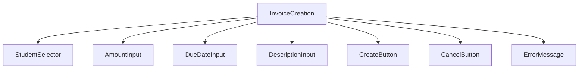
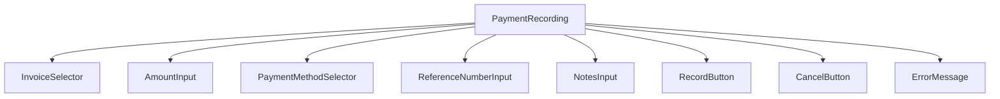
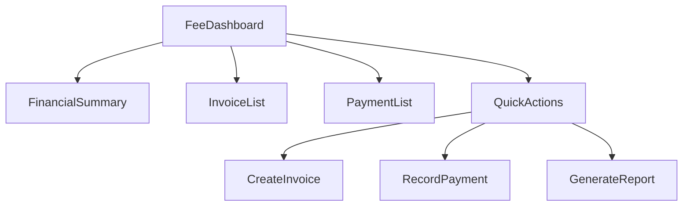

# Fee Management System Plan

## 1. Feature Overview

The fee management system will allow administrators to create and manage student invoices, track payments, and generate financial reports. Parents/guardians will be able to view their children's invoices and payment history.

## 2. Database Model Design

### 2.1 Invoice Model
```typescript
interface Invoice {
  id: string;
  studentId: string;
  amount: number;
  dueDate: Date;
  status: 'paid' | 'unpaid' | 'overdue';
  description: string;
  invoiceNumber: string;
  issuedDate: Date;
  createdAt: Date;
  updatedAt: Date;
}
```

### 2.2 Payment Model
```typescript
interface Payment {
  id: string;
  invoiceId: string;
  amount: number;
  paymentDate: Date;
  paymentMethod: 'cash' | 'bank_transfer' | 'credit_card' | 'paypal';
  referenceNumber: string;
  notes: string;
  createdAt: Date;
  updatedAt: Date;
}
```

### 2.3 Database Schemas (Mongoose)

#### Invoice Schema
```typescript
const invoiceSchema = new mongoose.Schema({
  studentId: {
    type: mongoose.Schema.Types.ObjectId,
    ref: 'Student',
    required: true
  },
  amount: {
    type: Number,
    required: true,
    min: 0
  },
  dueDate: {
    type: Date,
    required: true
  },
  status: {
    type: String,
    default: 'unpaid',
    enum: ['paid', 'unpaid', 'overdue']
  },
  description: {
    type: String,
    required: true
  },
  invoiceNumber: {
    type: String,
    required: true,
    unique: true
  },
  issuedDate: {
    type: Date,
    default: Date.now
  }
}, {
  timestamps: true
});

// Indexes for better query performance
invoiceSchema.index({ studentId: 1 });
invoiceSchema.index({ dueDate: 1 });
invoiceSchema.index({ status: 1 });
invoiceSchema.index({ invoiceNumber: 1 });

export default mongoose.model('Invoice', invoiceSchema);
```

#### Payment Schema
```typescript
const paymentSchema = new mongoose.Schema({
  invoiceId: {
    type: mongoose.Schema.Types.ObjectId,
    ref: 'Invoice',
    required: true
  },
  amount: {
    type: Number,
    required: true,
    min: 0
  },
  paymentDate: {
    type: Date,
    default: Date.now
  },
  paymentMethod: {
    type: String,
    required: true,
    enum: ['cash', 'bank_transfer', 'credit_card', 'paypal']
  },
  referenceNumber: {
    type: String,
    required: false
  },
  notes: {
    type: String,
    required: false
  }
}, {
  timestamps: true
});

// Indexes for better query performance
paymentSchema.index({ invoiceId: 1 });
paymentSchema.index({ paymentDate: 1 });
paymentSchema.index({ paymentMethod: 1 });

export default mongoose.model('Payment', paymentSchema);
```

## 3. API Endpoints

### 3.1 Invoice Routes
```
GET    /api/invoices                    - Get all invoices
GET    /api/invoices/:id                - Get invoice by ID
GET    /api/invoices/student/:studentId - Get invoices for a student
POST   /api/invoices                    - Create new invoice
PUT    /api/invoices/:id                - Update invoice
DELETE /api/invoices/:id                - Delete invoice
GET    /api/invoices/stats              - Get invoice statistics
```

### 3.2 Payment Routes
```
GET    /api/payments                    - Get all payments
GET    /api/payments/:id                - Get payment by ID
GET    /api/payments/invoice/:invoiceId - Get payments for an invoice
GET    /api/payments/student/:studentId - Get payments for a student
POST   /api/payments                    - Record payment
PUT    /api/payments/:id                - Update payment
DELETE /api/payments/:id                - Delete payment
GET    /api/payments/stats              - Get payment statistics
```

### 3.3 Request/Response Examples

#### Create Invoice (POST /api/invoices)
```json
// Request Body
{
  "studentId": "student123",
  "amount": 500,
  "dueDate": "2023-07-15",
  "description": "Tuition fee for June 2023",
  "invoiceNumber": "INV-2023-001"
}

// Response
{
  "success": true,
  "data": {
    "id": "invoice999",
    "studentId": "student123",
    "amount": 500,
    "dueDate": "2023-07-15T00:00:00.000Z",
    "status": "unpaid",
    "description": "Tuition fee for June 2023",
    "invoiceNumber": "INV-2023-001",
    "issuedDate": "2023-06-15T00:00:00.000Z",
    "createdAt": "2023-06-15T08:30:00.000Z",
    "updatedAt": "2023-06-15T08:30:00.000Z"
  }
}
```

#### Record Payment (POST /api/payments)
```json
// Request Body
{
  "invoiceId": "invoice999",
  "amount": 500,
  "paymentMethod": "bank_transfer",
  "referenceNumber": "BT-2023-001",
  "notes": "Payment for June tuition"
}

// Response
{
  "success": true,
  "data": {
    "id": "payment888",
    "invoiceId": "invoice999",
    "amount": 500,
    "paymentDate": "2023-06-20T00:00:00.000Z",
    "paymentMethod": "bank_transfer",
    "referenceNumber": "BT-2023-001",
    "notes": "Payment for June tuition",
    "createdAt": "2023-06-20T08:30:00.000Z",
    "updatedAt": "2023-06-20T08:30:00.000Z"
  }
}
```

## 4. Backend Implementation

### 4.1 Invoice Controller
```typescript
// invoiceController.ts
class InvoiceController {
  // Get all invoices
  async getAllInvoices(req: Request, res: Response) {
    try {
      const { studentId, status, page = 1, limit = 10 } = req.query;
      
      const filter: any = {};
      if (studentId) filter.studentId = studentId;
      if (status) filter.status = status;
      
      const invoices = await Invoice.find(filter)
        .populate('studentId', 'firstName lastName')
        .limit(limit * 1)
        .skip((page - 1) * limit)
        .sort({ createdAt: -1 });
      
      const total = await Invoice.countDocuments(filter);
      
      res.status(200).json({
        success: true,
        data: invoices,
        pagination: {
          page: parseInt(page as string),
          limit: parseInt(limit as string),
          total,
          pages: Math.ceil(total / limit)
        }
      });
    } catch (error) {
      res.status(500).json({
        success: false,
        message: 'Internal server error'
      });
    }
  }

  // Get invoice by ID
  async getInvoiceById(req: Request, res: Response) {
    try {
      const invoice = await Invoice.findById(req.params.id)
        .populate('studentId', 'firstName lastName');
      
      if (!invoice) {
        return res.status(404).json({
          success: false,
          message: 'Invoice not found'
        });
      }
      
      res.status(200).json({
        success: true,
        data: invoice
      });
    } catch (error) {
      res.status(500).json({
        success: false,
        message: 'Internal server error'
      });
    }
  }

  // Create new invoice
  async createInvoice(req: Request, res: Response) {
    try {
      const { studentId, amount, dueDate, description } = req.body;
      
      // Generate invoice number
      const invoiceNumber = await this.generateInvoiceNumber();
      
      const invoice = new Invoice({
        studentId,
        amount,
        dueDate,
        description,
        invoiceNumber
      });
      
      await invoice.save();
      
      // Populate references
      await invoice.populate('studentId', 'firstName lastName');
      
      res.status(201).json({
        success: true,
        data: invoice
      });
    } catch (error) {
      res.status(500).json({
        success: false,
        message: 'Internal server error'
      });
    }
  }

  // Update invoice
  async updateInvoice(req: Request, res: Response) {
    try {
      const invoice = await Invoice.findByIdAndUpdate(
        req.params.id,
        req.body,
        { new: true, runValidators: true }
      )
        .populate('studentId', 'firstName lastName');
      
      if (!invoice) {
        return res.status(404).json({
          success: false,
          message: 'Invoice not found'
        });
      }
      
      res.status(200).json({
        success: true,
        data: invoice
      });
    } catch (error) {
      res.status(500).json({
        success: false,
        message: 'Internal server error'
      });
    }
  }

  // Delete invoice
  async deleteInvoice(req: Request, res: Response) {
    try {
      // Check if there are payments associated with this invoice
      const payments = await Payment.find({ invoiceId: req.params.id });
      if (payments.length > 0) {
        return res.status(400).json({
          success: false,
          message: 'Cannot delete invoice with associated payments'
        });
      }
      
      const invoice = await Invoice.findByIdAndDelete(req.params.id);
      
      if (!invoice) {
        return res.status(404).json({
          success: false,
          message: 'Invoice not found'
        });
      }
      
      res.status(200).json({
        success: true,
        message: 'Invoice deleted successfully'
      });
    } catch (error) {
      res.status(500).json({
        success: false,
        message: 'Internal server error'
      });
    }
  }

  // Get invoice statistics
  async getInvoiceStats(req: Request, res: Response) {
    try {
      const totalInvoices = await Invoice.countDocuments();
      const paidInvoices = await Invoice.countDocuments({ status: 'paid' });
      const unpaidInvoices = await Invoice.countDocuments({ status: 'unpaid' });
      const overdueInvoices = await Invoice.countDocuments({ status: 'overdue' });
      
      const totalAmount = await Invoice.aggregate([
        {
          $group: {
            _id: null,
            total: { $sum: "$amount" }
          }
        }
      ]);
      
      const paidAmount = await Invoice.aggregate([
        {
          $match: { status: 'paid' }
        },
        {
          $group: {
            _id: null,
            total: { $sum: "$amount" }
          }
        }
      ]);
      
      res.status(200).json({
        success: true,
        data: {
          totalInvoices,
          paidInvoices,
          unpaidInvoices,
          overdueInvoices,
          totalAmount: totalAmount[0]?.total || 0,
          paidAmount: paidAmount[0]?.total || 0
        }
      });
    } catch (error) {
      res.status(500).json({
        success: false,
        message: 'Internal server error'
      });
    }
  }

  // Generate invoice number
  async generateInvoiceNumber() {
    const date = new Date();
    const year = date.getFullYear();
    const month = String(date.getMonth() + 1).padStart(2, '0');
    
    // Get the count of invoices for this month
    const invoiceCount = await Invoice.countDocuments({
      createdAt: {
        $gte: new Date(year, date.getMonth(), 1),
        $lt: new Date(year, date.getMonth() + 1, 1)
      }
    });
    
    const invoiceNumber = `INV-${year}-${month}-${String(invoiceCount + 1).padStart(3, '0')}`;
    return invoiceNumber;
  }
}
```

### 4.2 Payment Controller
```typescript
// paymentController.ts
class PaymentController {
  // Get all payments
  async getAllPayments(req: Request, res: Response) {
    try {
      const { invoiceId, studentId, paymentMethod, page = 1, limit = 10 } = req.query;
      
      const filter: any = {};
      if (invoiceId) filter.invoiceId = invoiceId;
      if (studentId) {
        // Get invoices for the student first
        const invoices = await Invoice.find({ studentId });
        const invoiceIds = invoices.map(invoice => invoice.id);
        filter.invoiceId = { $in: invoiceIds };
      }
      if (paymentMethod) filter.paymentMethod = paymentMethod;
      
      const payments = await Payment.find(filter)
        .populate('invoiceId', 'invoiceNumber description')
        .limit(limit * 1)
        .skip((page - 1) * limit)
        .sort({ paymentDate: -1 });
      
      const total = await Payment.countDocuments(filter);
      
      res.status(200).json({
        success: true,
        data: payments,
        pagination: {
          page: parseInt(page as string),
          limit: parseInt(limit as string),
          total,
          pages: Math.ceil(total / limit)
        }
      });
    } catch (error) {
      res.status(500).json({
        success: false,
        message: 'Internal server error'
      });
    }
  }

  // Get payment by ID
  async getPaymentById(req: Request, res: Response) {
    try {
      const payment = await Payment.findById(req.params.id)
        .populate('invoiceId', 'invoiceNumber description studentId')
        .populate('invoiceId.studentId', 'firstName lastName');
      
      if (!payment) {
        return res.status(404).json({
          success: false,
          message: 'Payment not found'
        });
      }
      
      res.status(200).json({
        success: true,
        data: payment
      });
    } catch (error) {
      res.status(500).json({
        success: false,
        message: 'Internal server error'
      });
    }
  }

  // Record payment
  async recordPayment(req: Request, res: Response) {
    try {
      const { invoiceId, amount, paymentMethod, referenceNumber, notes } = req.body;
      
      // Check if invoice exists
      const invoice = await Invoice.findById(invoiceId);
      if (!invoice) {
        return res.status(404).json({
          success: false,
          message: 'Invoice not found'
        });
      }
      
      // Create payment
      const payment = new Payment({
        invoiceId,
        amount,
        paymentMethod,
        referenceNumber,
        notes
      });
      
      await payment.save();
      
      // Update invoice status if fully paid
      const totalPayments = await Payment.aggregate([
        {
          $match: { invoiceId: mongoose.Types.ObjectId(invoiceId) }
        },
        {
          $group: {
            _id: null,
            total: { $sum: "$amount" }
          }
        }
      ]);
      
      const totalPaid = totalPayments[0]?.total || 0;
      
      if (totalPaid >= invoice.amount) {
        invoice.status = 'paid';
        await invoice.save();
      }
      
      // Populate references
      await payment.populate('invoiceId', 'invoiceNumber description');
      
      res.status(201).json({
        success: true,
        data: payment
      });
    } catch (error) {
      res.status(500).json({
        success: false,
        message: 'Internal server error'
      });
    }
  }

  // Update payment
  async updatePayment(req: Request, res: Response) {
    try {
      const payment = await Payment.findByIdAndUpdate(
        req.params.id,
        req.body,
        { new: true, runValidators: true }
      )
        .populate('invoiceId', 'invoiceNumber description');
      
      if (!payment) {
        return res.status(404).json({
          success: false,
          message: 'Payment not found'
        });
      }
      
      res.status(200).json({
        success: true,
        data: payment
      });
    } catch (error) {
      res.status(500).json({
        success: false,
        message: 'Internal server error'
      });
    }
  }

  // Delete payment
  async deletePayment(req: Request, res: Response) {
    try {
      const payment = await Payment.findByIdAndDelete(req.params.id);
      
      if (!payment) {
        return res.status(404).json({
          success: false,
          message: 'Payment not found'
        });
      }
      
      // Update invoice status
      const invoiceId = payment.invoiceId;
      const invoice = await Invoice.findById(invoiceId);
      if (invoice) {
        const totalPayments = await Payment.aggregate([
          {
            $match: { invoiceId: mongoose.Types.ObjectId(invoiceId) }
          },
          {
            $group: {
              _id: null,
              total: { $sum: "$amount" }
            }
          }
        ]);
        
        const totalPaid = totalPayments[0]?.total || 0;
        
        if (totalPaid < invoice.amount) {
          invoice.status = 'unpaid';
          await invoice.save();
        }
      }
      
      res.status(200).json({
        success: true,
        message: 'Payment deleted successfully'
      });
    } catch (error) {
      res.status(500).json({
        success: false,
        message: 'Internal server error'
      });
    }
  }

  // Get payment statistics
  async getPaymentStats(req: Request, res: Response) {
    try {
      const totalPayments = await Payment.countDocuments();
      
      const totalAmount = await Payment.aggregate([
        {
          $group: {
            _id: null,
            total: { $sum: "$amount" }
          }
        }
      ]);
      
      const paymentsByMethod = await Payment.aggregate([
        {
          $group: {
            _id: "$paymentMethod",
            count: { $sum: 1 },
            total: { $sum: "$amount" }
          }
        }
      ]);
      
      res.status(200).json({
        success: true,
        data: {
          totalPayments,
          totalAmount: totalAmount[0]?.total || 0,
          paymentsByMethod
        }
      });
    } catch (error) {
      res.status(500).json({
        success: false,
        message: 'Internal server error'
      });
    }
  }
}
```

### 4.3 Fee Service
```typescript
// feeService.ts
class FeeService {
  // Generate monthly invoices for all students
  async generateMonthlyInvoices(month: number, year: number, amount: number, description: string) {
    try {
      // Get all active students
      const students = await Student.find({ status: 'active' });
      
      const invoices = [];
      
      for (const student of students) {
        // Check if invoice already exists for this student and month
        const existingInvoice = await Invoice.findOne({
          studentId: student.id,
          description: { $regex: new RegExp(description, 'i') },
          createdAt: {
            $gte: new Date(year, month - 1, 1),
            $lt: new Date(year, month, 1)
          }
        });
        
        if (!existingInvoice) {
          // Generate invoice number
          const invoiceNumber = `INV-${year}-${String(month).padStart(2, '0')}-${String(invoices.length + 1).padStart(3, '0')}`;
          
          const invoice = new Invoice({
            studentId: student.id,
            amount,
            dueDate: new Date(year, month - 1, 15), // Due on 15th of the month
            description: `${description} - ${new Date(year, month - 1, 1).toLocaleString('default', { month: 'long' })} ${year}`,
            invoiceNumber
          });
          
          await invoice.save();
          invoices.push(invoice);
        }
      }
      
      return invoices;
    } catch (error) {
      throw new Error('Failed to generate monthly invoices');
    }
  }

  // Get student fee summary
  async getStudentFeeSummary(studentId: string) {
    try {
      // Get all invoices for the student
      const invoices = await Invoice.find({ studentId }).sort({ createdAt: -1 });
      
      // Get all payments for the student's invoices
      const invoiceIds = invoices.map(invoice => invoice.id);
      const payments = await Payment.find({ invoiceId: { $in: invoiceIds } }).sort({ paymentDate: -1 });
      
      // Calculate summary
      const totalInvoiced = invoices.reduce((sum, invoice) => sum + invoice.amount, 0);
      
      const totalPaid = payments.reduce((sum, payment) => sum + payment.amount, 0);
      
      const outstandingAmount = totalInvoiced - totalPaid;
      
      // Group by status
      const paidInvoices = invoices.filter(invoice => invoice.status === 'paid').length;
      const unpaidInvoices = invoices.filter(invoice => invoice.status === 'unpaid').length;
      const overdueInvoices = invoices.filter(invoice => invoice.status === 'overdue').length;
      
      return {
        studentId,
        totalInvoiced,
        totalPaid,
        outstandingAmount,
        paidInvoices,
        unpaidInvoices,
        overdueInvoices,
        invoices: invoices.map(invoice => ({
          id: invoice.id,
          invoiceNumber: invoice.invoiceNumber,
          amount: invoice.amount,
          dueDate: invoice.dueDate,
          status: invoice.status,
          description: invoice.description
        })),
        payments: payments.map(payment => ({
          id: payment.id,
          amount: payment.amount,
          paymentDate: payment.paymentDate,
          paymentMethod: payment.paymentMethod,
          referenceNumber: payment.referenceNumber
        }))
      };
    } catch (error) {
      throw new Error('Failed to get student fee summary');
    }
  }

  // Send payment reminders for overdue invoices
  async sendPaymentReminders() {
    try {
      // Get overdue invoices
      const overdueInvoices = await Invoice.find({ 
        status: 'unpaid',
        dueDate: { $lt: new Date() }
      }).populate('studentId', 'firstName lastName email');
      
      // Update status to overdue
      for (const invoice of overdueInvoices) {
        invoice.status = 'overdue';
        await invoice.save();
      }
      
      // In a real implementation, we would send email notifications here
      // For now, we'll just return the list of overdue invoices
      
      return overdueInvoices;
    } catch (error) {
      throw new Error('Failed to send payment reminders');
    }
  }

  // Generate financial report
  async generateFinancialReport(startDate: Date, endDate: Date) {
    try {
      // Get invoices created in the date range
      const invoices = await Invoice.find({
        createdAt: {
          $gte: startDate,
          $lte: endDate
        }
      });
      
      // Get payments made in the date range
      const payments = await Payment.find({
        paymentDate: {
          $gte: startDate,
          $lte: endDate
        }
      });
      
      // Calculate report data
      const totalInvoices = invoices.length;
      const totalInvoiceAmount = invoices.reduce((sum, invoice) => sum + invoice.amount, 0);
      
      const totalPayments = payments.length;
      const totalPaymentAmount = payments.reduce((sum, payment) => sum + payment.amount, 0);
      
      // Group invoices by status
      const paidInvoices = invoices.filter(invoice => invoice.status === 'paid').length;
      const unpaidInvoices = invoices.filter(invoice => invoice.status === 'unpaid').length;
      const overdueInvoices = invoices.filter(invoice => invoice.status === 'overdue').length;
      
      // Group payments by method
      const paymentsByMethod = {};
      for (const payment of payments) {
        if (!paymentsByMethod[payment.paymentMethod]) {
          paymentsByMethod[payment.paymentMethod] = {
            count: 0,
            amount: 0
          };
        }
        paymentsByMethod[payment.paymentMethod].count++;
        paymentsByMethod[payment.paymentMethod].amount += payment.amount;
      }
      
      return {
        period: {
          startDate,
          endDate
        },
        invoices: {
          total: totalInvoices,
          totalAmount: totalInvoiceAmount,
          paid: paidInvoices,
          unpaid: unpaidInvoices,
          overdue: overdueInvoices
        },
        payments: {
          total: totalPayments,
          totalAmount: totalPaymentAmount,
          byMethod: paymentsByMethod
        }
      };
    } catch (error) {
      throw new Error('Failed to generate financial report');
    }
  }
}
```

## 5. Frontend Implementation

### 5.1 UI Components

#### Invoice Creation Component


#### Payment Recording Component


#### Fee Dashboard Component


### 5.2 Page Components

#### Invoice Management Pages
- Invoice List Page
- Create Invoice Page
- Edit Invoice Page
- Invoice Details Page

#### Payment Management Pages
- Payment List Page
- Record Payment Page
- Payment Details Page

#### Reporting Pages
- Financial Dashboard Page
- Student Fee Summary Page
- Monthly Financial Report Page

### 5.3 Redux State Management

#### Fee Slice
```typescript
// feeSlice.ts
interface FeeState {
  invoices: Invoice[];
  payments: Payment[];
  currentInvoice: Invoice | null;
  currentPayment: Payment | null;
  loading: boolean;
  error: string | null;
  filters: {
    studentId: string | null;
    status: string | null;
    paymentMethod: string | null;
  };
  stats: {
    totalInvoices: number;
    paidInvoices: number;
    unpaidInvoices: number;
    overdueInvoices: number;
    totalAmount: number;
    paidAmount: number;
  };
}

const feeSlice = createSlice({
  name: 'fee',
  initialState,
  reducers: {
    setInvoices(state, action) {
      state.invoices = action.payload;
    },
    setPayments(state, action) {
      state.payments = action.payload;
    },
    addInvoice(state, action) {
      state.invoices.push(action.payload);
    },
    updateInvoice(state, action) {
      const index = state.invoices.findIndex(invoice => invoice.id === action.payload.id);
      if (index !== -1) {
        state.invoices[index] = action.payload;
      }
    },
    deleteInvoice(state, action) {
      state.invoices = state.invoices.filter(invoice => invoice.id !== action.payload);
    },
    addPayment(state, action) {
      state.payments.push(action.payload);
    },
    updatePayment(state, action) {
      const index = state.payments.findIndex(payment => payment.id === action.payload.id);
      if (index !== -1) {
        state.payments[index] = action.payload;
      }
    },
    deletePayment(state, action) {
      state.payments = state.payments.filter(payment => payment.id !== action.payload);
    },
    setStats(state, action) {
      state.stats = action.payload;
    },
    setLoading(state, action) {
      state.loading = action.payload;
    },
    setError(state, action) {
      state.error = action.payload;
    }
  }
});

// Async thunks
export const fetchInvoices = createAsyncThunk(
  'fee/fetchInvoices',
  async (filters: { studentId?: string; status?: string }, { rejectWithValue }) => {
    try {
      const response = await feeApi.getInvoices(filters);
      return response.data;
    } catch (error) {
      return rejectWithValue(error.response.data.message);
    }
  }
);

export const createInvoice = createAsyncThunk(
  'fee/createInvoice',
  async (invoiceData: InvoiceData, { rejectWithValue }) => {
    try {
      const response = await feeApi.createInvoice(invoiceData);
      return response.data;
    } catch (error) {
      return rejectWithValue(error.response.data.message);
    }
  }
);

export const recordPayment = createAsyncThunk(
  'fee/recordPayment',
  async (paymentData: PaymentData, { rejectWithValue }) => {
    try {
      const response = await feeApi.recordPayment(paymentData);
      return response.data;
    } catch (error) {
      return rejectWithValue(error.response.data.message);
    }
  }
);
```

## 6. API Service Integration

### 6.1 Fee API Service
```typescript
// feeApi.ts
class FeeApi {
  // Get invoices
  static async getInvoices(filters: { studentId?: string; status?: string; page?: number; limit?: number }) {
    const queryParams = new URLSearchParams();
    if (filters.studentId) queryParams.append('studentId', filters.studentId);
    if (filters.status) queryParams.append('status', filters.status);
    if (filters.page) queryParams.append('page', filters.page.toString());
    if (filters.limit) queryParams.append('limit', filters.limit.toString());
    
    return await api.get(`/invoices?${queryParams.toString()}`);
  }

  // Create invoice
  static async createInvoice(invoiceData: InvoiceData) {
    return await api.post('/invoices', invoiceData);
  }

  // Update invoice
  static async updateInvoice(id: string, invoiceData: Partial<Invoice>) {
    return await api.put(`/invoices/${id}`, invoiceData);
  }

  // Delete invoice
  static async deleteInvoice(id: string) {
    return await api.delete(`/invoices/${id}`);
  }

  // Get invoice statistics
  static async getInvoiceStats() {
    return await api.get('/invoices/stats');
  }

  // Get payments
  static async getPayments(filters: { invoiceId?: string; studentId?: string; paymentMethod?: string; page?: number; limit?: number }) {
    const queryParams = new URLSearchParams();
    if (filters.invoiceId) queryParams.append('invoiceId', filters.invoiceId);
    if (filters.studentId) queryParams.append('studentId', filters.studentId);
    if (filters.paymentMethod) queryParams.append('paymentMethod', filters.paymentMethod);
    if (filters.page) queryParams.append('page', filters.page.toString());
    if (filters.limit) queryParams.append('limit', filters.limit.toString());
    
    return await api.get(`/payments?${queryParams.toString()}`);
  }

  // Record payment
  static async recordPayment(paymentData: PaymentData) {
    return await api.post('/payments', paymentData);
  }

  // Update payment
  static async updatePayment(id: string, paymentData: Partial<Payment>) {
    return await api.put(`/payments/${id}`, paymentData);
  }

  // Delete payment
  static async deletePayment(id: string) {
    return await api.delete(`/payments/${id}`);
  }

  // Get payment statistics
  static async getPaymentStats() {
    return await api.get('/payments/stats');
  }

  // Generate student fee summary
  static async getStudentFeeSummary(studentId: string) {
    return await api.get(`/fees/student/${studentId}/summary`);
  }

  // Generate financial report
  static async generateFinancialReport(startDate: string, endDate: string) {
    return await api.get(`/fees/reports/financial?startDate=${startDate}&endDate=${endDate}`);
  }
}
```

## 7. Business Logic and Validation

### 7.1 Validation Rules
- Invoice amount must be greater than 0
- Due date must be in the future
- Invoice number must be unique
- Payment amount cannot exceed invoice balance
- Payment date cannot be in the future

### 7.2 Business Rules
- Automatically update invoice status when fully paid
- Generate overdue status for unpaid invoices past due date
- Prevent deletion of invoices with associated payments
- Calculate outstanding balances for students
- Generate payment reminders for overdue invoices

## 8. Reporting Features

### 8.1 Financial Reports
- Monthly financial summary
- Student fee summaries
- Payment method analysis
- Outstanding invoices report
- Overdue invoices report

### 8.2 Export Options
- PDF export of invoices and receipts
- Excel export of financial data
- CSV export for importing into accounting systems

## 9. Security Considerations

- Role-based access control (only admins can create invoices and record payments)
- Input validation and sanitization
- Rate limiting for API endpoints
- Audit logging for all financial operations
- Secure storage of payment information

## 10. Performance Optimization

- Database indexing on frequently queried fields (studentId, invoiceId, paymentMethod)
- Pagination for large datasets
- Caching of frequently accessed financial summaries
- Efficient querying for financial reports
- Background jobs for batch operations (e.g., generating monthly invoices)