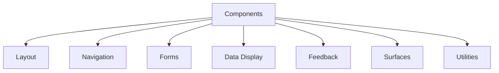

# Frontend Component Library Plan

## 1. Overview

The frontend component library will provide a consistent, reusable set of UI components for the school management system. This will improve development efficiency, ensure UI consistency, and enhance the user experience.

## 2. Component Library Structure

### 2.1 Core Components


### 2.2 Component Hierarchy

```mermaid
graph TD
    A[ComponentLibrary] --> B[Layout Components]
    A --> C[Navigation Components]
    A --> D[Form Components]
    A --> E[Data Display Components]
    A --> F[Feedback Components]
    A --> G[Surface Components]
    A --> H[Utility Components]
    
    B --> B1[Container]
    B --> B2[Grid]
    B --> B3[Header]
    B --> B4[Footer]
    B --> B5[Sidebar]
    
    C --> C1[Navbar]
    C --> C2[Menu]
    C --> C3[Tab]
    C --> C4[Breadcrumb]
    C --> C5[Pagination]
    
    D --> D1[Input]
    D --> D2[Select]
    D --> D3[Checkbox]
    D --> D4[Radio]
    D --> D5[Switch]
    D --> D6[Textarea]
    D --> D7[DatePicker]
    D --> D8[TimePicker]
    
    E --> E1[Table]
    E --> E2[Card]
    E --> E3[List]
    E --> E4[Badge]
    E --> E5[Avatar]
    E --> E6[Progress]
    E --> E7[Chart]
    
    F --> F1[Alert]
    F --> F2[Modal]
    F --> F3[Toast]
    F --> F4[Tooltip]
    F --> F5[Popover]
    F --> F6[Spinner]
    F --> F7[Snackbar]
    
    G --> G1[Paper]
    G --> G2[Accordion]
    G --> G3[Panel]
    
    H --> H1[Button]
    H --> H2[Icon]
    H --> H3[Divider]
    H --> H4[Typography]
```


## 3. Detailed Component Specifications

### 3.1 Layout Components

#### Container
```typescript
interface ContainerProps {
  children: React.ReactNode;
  maxWidth?: 'xs' | 'sm' | 'md' | 'lg' | 'xl' | 'fluid';
  className?: string;
  style?: React.CSSProperties;
}

const Container: React.FC<ContainerProps> = ({ 
  children, 
  maxWidth = 'lg', 
  className = '', 
  style 
}) => {
  // Implementation
};
```

#### Grid System
```typescript
interface GridProps {
  container?: boolean;
  item?: boolean;
  xs?: number;
  sm?: number;
  md?: number;
  lg?: number;
  xl?: number;
  spacing?: number;
  direction?: 'row' | 'column' | 'row-reverse' | 'column-reverse';
  justifyContent?: 'flex-start' | 'center' | 'flex-end' | 'space-between' | 'space-around';
  alignItems?: 'flex-start' | 'center' | 'flex-end' | 'stretch' | 'baseline';
  children: React.ReactNode;
  className?: string;
}

const Grid: React.FC<GridProps> = ({ 
  container, 
  item, 
  xs, 
  sm, 
  md, 
  lg, 
  xl, 
  spacing, 
  direction, 
  justifyContent, 
  alignItems, 
  children, 
  className 
}) => {
  // Implementation
};
```

### 3.2 Form Components

#### Input
```typescript
interface InputProps {
  id?: string;
  name?: string;
  type?: string;
  value?: string;
  onChange?: (e: React.ChangeEvent<HTMLInputElement>) => void;
  placeholder?: string;
  label?: string;
  error?: string;
  helperText?: string;
  disabled?: boolean;
  required?: boolean;
  fullWidth?: boolean;
  variant?: 'outlined' | 'filled' | 'standard';
  size?: 'small' | 'medium';
  startAdornment?: React.ReactNode;
  endAdornment?: React.ReactNode;
  className?: string;
}

const Input: React.FC<InputProps> = ({ 
  id,
  name,
  type = 'text',
  value,
  onChange,
  placeholder,
  label,
  error,
  helperText,
  disabled = false,
  required = false,
  fullWidth = false,
  variant = 'outlined',
  size = 'medium',
  startAdornment,
  endAdornment,
  className
}) => {
  // Implementation
};
```

#### Select
```typescript
interface SelectOption {
  value: string | number;
  label: string;
}

interface SelectProps {
  id?: string;
  name?: string;
  value?: string | number;
  onChange?: (e: React.ChangeEvent<HTMLSelectElement>) => void;
  options: SelectOption[];
  placeholder?: string;
  label?: string;
  error?: string;
  helperText?: string;
  disabled?: boolean;
  required?: boolean;
  fullWidth?: boolean;
  variant?: 'outlined' | 'filled' | 'standard';
  size?: 'small' | 'medium';
  className?: string;
}

const Select: React.FC<SelectProps> = ({ 
  id,
  name,
  value,
  onChange,
  options,
  placeholder,
  label,
  error,
  helperText,
  disabled = false,
  required = false,
  fullWidth = false,
  variant = 'outlined',
  size = 'medium',
  className
}) => {
  // Implementation
};
```

#### Button
```typescript
interface ButtonProps {
  children: React.ReactNode;
  onClick?: (e: React.MouseEvent<HTMLButtonElement>) => void;
  type?: 'button' | 'submit' | 'reset';
  variant?: 'contained' | 'outlined' | 'text';
  color?: 'primary' | 'secondary' | 'success' | 'error' | 'warning' | 'info';
  size?: 'small' | 'medium' | 'large';
  disabled?: boolean;
  fullWidth?: boolean;
  startIcon?: React.ReactNode;
  endIcon?: React.ReactNode;
  className?: string;
  style?: React.CSSProperties;
}

const Button: React.FC<ButtonProps> = ({ 
  children,
  onClick,
  type = 'button',
  variant = 'contained',
  color = 'primary',
  size = 'medium',
  disabled = false,
  fullWidth = false,
  startIcon,
  endIcon,
  className,
  style
}) => {
  // Implementation
};
```

### 3.3 Data Display Components

#### Table
```typescript
interface TableColumn {
  key: string;
  title: string;
  render?: (value: any, row: any) => React.ReactNode;
  sortable?: boolean;
  width?: string | number;
}

interface TableProps {
  columns: TableColumn[];
  data: any[];
  loading?: boolean;
  onRowClick?: (row: any) => void;
  sortable?: boolean;
  pagination?: boolean;
  pageSize?: number;
  className?: string;
}

const Table: React.FC<TableProps> = ({ 
  columns,
  data,
  loading = false,
  onRowClick,
  sortable = false,
  pagination = false,
  pageSize = 10,
  className
}) => {
  // Implementation
};
```

#### Card
```typescript
interface CardProps {
  children: React.ReactNode;
  title?: string;
  subtitle?: string;
  actions?: React.ReactNode;
  elevation?: number;
  variant?: 'elevated' | 'outlined';
  className?: string;
}

const Card: React.FC<CardProps> = ({ 
  children,
  title,
  subtitle,
  actions,
  elevation = 1,
  variant = 'elevated',
  className
}) => {
  // Implementation
};
```

### 3.4 Feedback Components

#### Modal
```typescript
interface ModalProps {
  open: boolean;
  onClose: () => void;
  title?: string;
  children: React.ReactNode;
  actions?: React.ReactNode;
  size?: 'small' | 'medium' | 'large' | 'fullScreen';
  className?: string;
}

const Modal: React.FC<ModalProps> = ({ 
  open,
  onClose,
  title,
  children,
  actions,
  size = 'medium',
  className
}) => {
  // Implementation
};
```

#### Alert
```typescript
interface AlertProps {
  children: React.ReactNode;
  severity?: 'success' | 'info' | 'warning' | 'error';
  variant?: 'filled' | 'outlined' | 'standard';
  onClose?: () => void;
  className?: string;
}

const Alert: React.FC<AlertProps> = ({ 
  children,
  severity = 'info',
  variant = 'standard',
  onClose,
  className
}) => {
  // Implementation
};
```

## 4. Component Implementation Plan

### 4.1 Phase 1: Core Components (Week 1)
- Button
- Input
- Select
- Container
- Grid
- Typography

### 4.2 Phase 2: Form Components (Week 2)
- Checkbox
- Radio
- Switch
- Textarea
- DatePicker
- TimePicker
- Form validation utilities

### 4.3 Phase 3: Data Display Components (Week 3)
- Table
- Card
- List
- Badge
- Avatar
- Progress
- Chart components

### 4.4 Phase 4: Feedback Components (Week 4)
- Alert
- Modal
- Toast
- Tooltip
- Popover
- Spinner
- Snackbar

### 4.5 Phase 5: Navigation Components (Week 5)
- Navbar
- Menu
- Tab
- Breadcrumb
- Pagination
- Sidebar

### 4.6 Phase 6: Surface Components (Week 6)
- Paper
- Accordion
- Panel

## 5. Styling and Theming

### 5.1 Theme Configuration
```typescript
interface Theme {
  colors: {
    primary: string;
    secondary: string;
    success: string;
    error: string;
    warning: string;
    info: string;
    background: {
      default: string;
      paper: string;
    };
    text: {
      primary: string;
      secondary: string;
      disabled: string;
    };
  };
  spacing: (factor: number) => string;
  breakpoints: {
    xs: number;
    sm: number;
    md: number;
    lg: number;
    xl: number;
  };
  typography: {
    fontFamily: string;
    fontSize: {
      small: string;
      medium: string;
      large: string;
      h1: string;
      h2: string;
      h3: string;
      h4: string;
      h5: string;
      h6: string;
    };
  };
  shadows: string[];
}

const defaultTheme: Theme = {
  colors: {
    primary: '#1976d2',
    secondary: '#dc004e',
    success: '#4caf50',
    error: '#f44336',
    warning: '#ff9800',
    info: '#2196f3',
    background: {
      default: '#fafafa',
      paper: '#ffffff'
    },
    text: {
      primary: 'rgba(0, 0, 0, 0.87)',
      secondary: 'rgba(0, 0, 0, 0.6)',
      disabled: 'rgba(0, 0, 0, 0.38)'
    }
  },
  spacing: (factor: number) => `${4 * factor}px`,
  breakpoints: {
    xs: 0,
    sm: 600,
    md: 960,
    lg: 1280,
    xl: 1920
  },
  typography: {
    fontFamily: '"Roboto", "Helvetica", "Arial", sans-serif',
    fontSize: {
      small: '0.875rem',
      medium: '1rem',
      large: '1.25rem',
      h1: '2.5rem',
      h2: '2rem',
      h3: '1.75rem',
      h4: '1.5rem',
      h5: '1.25rem',
      h6: '1rem'
    }
  },
  shadows: [
    'none',
    '0px 2px 1px -1px rgba(0,0,0,0.2),0px 1px 1px 0px rgba(0,0,0,0.14),0px 1px 3px 0px rgba(0,0,0,0.12)',
    // ... more shadow definitions
  ]
};
```

### 5.2 CSS Modules Structure
```
components/
├── Button/
│   ├── Button.module.css
│   └── Button.tsx
├── Input/
│   ├── Input.module.css
│   └── Input.tsx
├── Card/
│   ├── Card.module.css
│   └── Card.tsx
└── ...
```

### 5.3 Responsive Design
- Mobile-first approach
- Breakpoint-based responsive utilities
- Flexible grid system
- Touch-friendly interactions

## 6. Accessibility Implementation

### 6.1 WCAG Compliance
- Proper semantic HTML
- ARIA attributes where needed
- Keyboard navigation support
- Screen reader compatibility
- Color contrast compliance

### 6.2 Focus Management
- Visible focus indicators
- Logical tab order
- Skip navigation links
- Focus trapping for modals

## 7. Performance Optimization

### 7.1 Code Splitting
- Component-level code splitting
- Lazy loading for non-critical components
- Tree shaking for unused exports

### 7.2 Bundle Optimization
- Minification and compression
- Image optimization
- Caching strategies
- Critical CSS inlining

## 8. Testing Strategy

### 8.1 Unit Testing
- Jest for logic testing
- React Testing Library for component testing
- Snapshot testing for UI consistency

### 8.2 Integration Testing
- Component interaction testing
- Form validation testing
- State management testing

### 8.3 End-to-End Testing
- Cypress for UI flow testing
- Accessibility testing
- Cross-browser compatibility testing

## 9. Documentation

### 9.1 Component Documentation
- Props documentation
- Usage examples
- Best practices
- Accessibility guidelines

### 9.2 Storybook Integration
- Interactive component showcase
- Props controls
- Accessibility testing tools
- Performance monitoring

## 10. Deployment and Distribution

### 10.1 Package Structure
```
@school-management-system/components/
├── dist/
├── src/
├── package.json
├── README.md
└── tsconfig.json
```

### 10.2 Versioning Strategy
- Semantic versioning (SemVer)
- Release notes for each version
- Migration guides for breaking changes
- Backward compatibility when possible

## 11. Maintenance Plan

### 11.1 Regular Updates
- Dependency updates
- Security patches
- Browser compatibility updates
- Performance improvements

### 11.2 Community Engagement
- GitHub issues and discussions
- Contribution guidelines
- Code of conduct
- Regular release cycles

## 12. Implementation Roadmap

### 12.1 Month 1: Foundation
- Set up project structure
- Implement core components (Button, Input, Container)
- Create theme system
- Set up testing infrastructure

### 12.2 Month 2: Form Components
- Implement complete form component library
- Add form validation utilities
- Create form layout components

### 12.3 Month 3: Data Display
- Implement data display components
- Add charting components
- Create responsive table component

### 12.4 Month 4: Feedback and Navigation
- Implement feedback components
- Create navigation components
- Add accessibility features

### 12.5 Month 5: Advanced Features
- Implement advanced components
- Add internationalization support
- Create documentation and examples

### 12.6 Month 6: Optimization and Release
- Performance optimization
- Accessibility auditing
- Release first stable version
- Create distribution package