# Frontend State Management Plan

## 1. Overview

This plan outlines the implementation of a comprehensive state management solution for the school management system frontend using Redux Toolkit. The solution will manage global application state, handle asynchronous operations, and provide a consistent data flow throughout the application.

## 2. State Management Architecture

### 2.1 Redux Toolkit Structure

```mermaid
graph TD
    A[Redux Store] --> B[Auth Slice]
    A --> C[Student Slice]
    A --> D[Teacher Slice]
    A --> E[Class Slice]
    A --> F[Subject Slice]
    A --> G[Attendance Slice]
    A --> H[Grade Slice]
    A --> I[Assignment Slice]
    A --> J[Fee Slice]
    A --> K[Payment Slice]
    A --> L[Timetable Slice]
    A --> M[Announcement Slice]
    A --> N[User Slice]
    
    B --> B1[User State]
    B --> B2[Auth Status]
    B --> B3[Auth Errors]
    
    C --> C1[Students List]
    C --> C2[Student Details]
    C --> C3[Student Filters]
    
    G --> G1[Attendance Records]
    G --> G2[Attendance Filters]
    G --> G3[Attendance Summary]
    
    H --> H1[Grades List]
    H --> H2[Grade Details]
    H --> H3[Grade Reports]
    
    L --> L1[Timetable Entries]
    L --> L2[Timetable Filters]
    L --> L3[Schedule Data]
```


### 2.2 Store Configuration
```typescript
// store.ts
import { configureStore } from '@reduxjs/toolkit';
import { combineReducers } from 'redux';
import authSlice from './slices/authSlice';
import studentSlice from './slices/studentSlice';
import teacherSlice from './slices/teacherSlice';
import classSlice from './slices/classSlice';
import subjectSlice from './slices/subjectSlice';
import attendanceSlice from './slices/attendanceSlice';
import gradeSlice from './slices/gradeSlice';
import assignmentSlice from './slices/assignmentSlice';
import feeSlice from './slices/feeSlice';
import paymentSlice from './slices/paymentSlice';
import timetableSlice from './slices/timetableSlice';
import announcementSlice from './slices/announcementSlice';
import userSlice from './slices/userSlice';

const rootReducer = combineReducers({
  auth: authSlice,
  students: studentSlice,
  teachers: teacherSlice,
  classes: classSlice,
  subjects: subjectSlice,
  attendance: attendanceSlice,
  grades: gradeSlice,
  assignments: assignmentSlice,
  fees: feeSlice,
  payments: paymentSlice,
  timetable: timetableSlice,
  announcements: announcementSlice,
  users: userSlice
});

const store = configureStore({
  reducer: rootReducer,
  middleware: (getDefaultMiddleware) =>
    getDefaultMiddleware({
      serializableCheck: {
        ignoredActions: ['persist/PERSIST'],
      },
    }),
  devTools: process.env.NODE_ENV !== 'production',
});

export type RootState = ReturnType<typeof rootReducer>;
export type AppDispatch = typeof store.dispatch;
export default store;
```

## 3. Slice Implementation Details

### 3.1 Auth Slice
```typescript
// slices/authSlice.ts
import { createSlice, createAsyncThunk } from '@reduxjs/toolkit';
import { authApi } from '../services/api';

interface AuthState {
  user: User | null;
  token: string | null;
  isAuthenticated: boolean;
  loading: boolean;
  error: string | null;
}

const initialState: AuthState = {
  user: null,
  token: localStorage.getItem('token'),
  isAuthenticated: !!localStorage.getItem('token'),
  loading: false,
  error: null,
};

// Async thunks
export const login = createAsyncThunk(
  'auth/login',
  async (credentials: LoginCredentials, { rejectWithValue }) => {
    try {
      const response = await authApi.login(credentials);
      localStorage.setItem('token', response.data.token);
      return response.data;
    } catch (error) {
      return rejectWithValue(error.response.data.message);
    }
  }
);

export const register = createAsyncThunk(
  'auth/register',
  async (userData: RegisterData, { rejectWithValue }) => {
    try {
      const response = await authApi.register(userData);
      localStorage.setItem('token', response.data.token);
      return response.data;
    } catch (error) {
      return rejectWithValue(error.response.data.message);
    }
  }
);

export const logout = createAsyncThunk('auth/logout', async () => {
  localStorage.removeItem('token');
});

const authSlice = createSlice({
  name: 'auth',
  initialState,
  reducers: {
    clearError: (state) => {
      state.error = null;
    },
  },
  extraReducers: (builder) => {
    builder
      // Login
      .addCase(login.pending, (state) => {
        state.loading = true;
        state.error = null;
      })
      .addCase(login.fulfilled, (state, action) => {
        state.loading = false;
        state.isAuthenticated = true;
        state.user = action.payload.user;
        state.token = action.payload.token;
      })
      .addCase(login.rejected, (state, action) => {
        state.loading = false;
        state.error = action.payload as string;
      })
      // Register
      .addCase(register.pending, (state) => {
        state.loading = true;
        state.error = null;
      })
      .addCase(register.fulfilled, (state, action) => {
        state.loading = false;
        state.isAuthenticated = true;
        state.user = action.payload.user;
        state.token = action.payload.token;
      })
      .addCase(register.rejected, (state, action) => {
        state.loading = false;
        state.error = action.payload as string;
      })
      // Logout
      .addCase(logout.fulfilled, (state) => {
        state.user = null;
        state.token = null;
        state.isAuthenticated = false;
      });
  },
});

export const { clearError } = authSlice.actions;
export default authSlice.reducer;
```

### 3.2 Student Slice
```typescript
// slices/studentSlice.ts
import { createSlice, createAsyncThunk } from '@reduxjs/toolkit';
import { studentApi } from '../services/api';

interface StudentState {
  students: Student[];
  selectedStudent: Student | null;
  loading: boolean;
  error: string | null;
  filters: {
    classId: string | null;
    status: string | null;
  };
  pagination: {
    page: number;
    limit: number;
    total: number;
  };
}

const initialState: StudentState = {
  students: [],
  selectedStudent: null,
  loading: false,
  error: null,
  filters: {
    classId: null,
    status: null,
  },
  pagination: {
    page: 1,
    limit: 10,
    total: 0,
  },
};

// Async thunks
export const fetchStudents = createAsyncThunk(
  'students/fetchStudents',
  async (params: { page?: number; limit?: number; classId?: string; status?: string }, { rejectWithValue }) => {
    try {
      const response = await studentApi.getStudents(params);
      return response.data;
    } catch (error) {
      return rejectWithValue(error.response.data.message);
    }
  }
);

export const fetchStudentById = createAsyncThunk(
  'students/fetchStudentById',
  async (id: string, { rejectWithValue }) => {
    try {
      const response = await studentApi.getStudentById(id);
      return response.data;
    } catch (error) {
      return rejectWithValue(error.response.data.message);
    }
  }
);

export const createStudent = createAsyncThunk(
  'students/createStudent',
  async (studentData: CreateStudentData, { rejectWithValue }) => {
    try {
      const response = await studentApi.createStudent(studentData);
      return response.data;
    } catch (error) {
      return rejectWithValue(error.response.data.message);
    }
  }
);

export const updateStudent = createAsyncThunk(
  'students/updateStudent',
  async ({ id, data }: { id: string; data: UpdateStudentData }, { rejectWithValue }) => {
    try {
      const response = await studentApi.updateStudent(id, data);
      return response.data;
    } catch (error) {
      return rejectWithValue(error.response.data.message);
    }
  }
);

export const deleteStudent = createAsyncThunk(
  'students/deleteStudent',
  async (id: string, { rejectWithValue }) => {
    try {
      await studentApi.deleteStudent(id);
      return id;
    } catch (error) {
      return rejectWithValue(error.response.data.message);
    }
  }
);

const studentSlice = createSlice({
  name: 'students',
  initialState,
  reducers: {
    setFilters: (state, action) => {
      state.filters = { ...state.filters, ...action.payload };
    },
    clearError: (state) => {
      state.error = null;
    },
    clearSelectedStudent: (state) => {
      state.selectedStudent = null;
    },
  },
  extraReducers: (builder) => {
    builder
      // Fetch students
      .addCase(fetchStudents.pending, (state) => {
        state.loading = true;
        state.error = null;
      })
      .addCase(fetchStudents.fulfilled, (state, action) => {
        state.loading = false;
        state.students = action.payload.students;
        state.pagination = action.payload.pagination;
      })
      .addCase(fetchStudents.rejected, (state, action) => {
        state.loading = false;
        state.error = action.payload as string;
      })
      // Fetch student by ID
      .addCase(fetchStudentById.pending, (state) => {
        state.loading = true;
        state.error = null;
      })
      .addCase(fetchStudentById.fulfilled, (state, action) => {
        state.loading = false;
        state.selectedStudent = action.payload;
      })
      .addCase(fetchStudentById.rejected, (state, action) => {
        state.loading = false;
        state.error = action.payload as string;
      })
      // Create student
      .addCase(createStudent.fulfilled, (state, action) => {
        state.students.push(action.payload);
      })
      // Update student
      .addCase(updateStudent.fulfilled, (state, action) => {
        const index = state.students.findIndex(student => student.id === action.payload.id);
        if (index !== -1) {
          state.students[index] = action.payload;
        }
        if (state.selectedStudent && state.selectedStudent.id === action.payload.id) {
          state.selectedStudent = action.payload;
        }
      })
      // Delete student
      .addCase(deleteStudent.fulfilled, (state, action) => {
        state.students = state.students.filter(student => student.id !== action.payload);
        if (state.selectedStudent && state.selectedStudent.id === action.payload) {
          state.selectedStudent = null;
        }
      });
  },
});

export const { setFilters, clearError, clearSelectedStudent } = studentSlice.actions;
export default studentSlice.reducer;
```

### 3.3 Attendance Slice
```typescript
// slices/attendanceSlice.ts
import { createSlice, createAsyncThunk } from '@reduxjs/toolkit';
import { attendanceApi } from '../services/api';

interface AttendanceState {
  records: Attendance[];
  selectedRecord: Attendance | null;
  loading: boolean;
  error: string | null;
  filters: {
    classId: string | null;
    date: string | null;
    studentId: string | null;
  };
  summary: {
    present: number;
    absent: number;
    late: number;
  };
}

const initialState: AttendanceState = {
  records: [],
  selectedRecord: null,
  loading: false,
  error: null,
  filters: {
    classId: null,
    date: null,
    studentId: null,
  },
  summary: {
    present: 0,
    absent: 0,
    late: 0,
  },
};

// Async thunks
export const fetchAttendanceRecords = createAsyncThunk(
  'attendance/fetchAttendanceRecords',
  async (filters: { classId?: string; date?: string; studentId?: string }, { rejectWithValue }) => {
    try {
      const response = await attendanceApi.getAttendanceRecords(filters);
      return response.data;
    } catch (error) {
      return rejectWithValue(error.response.data.message);
    }
  }
);

export const recordAttendance = createAsyncThunk(
  'attendance/recordAttendance',
  async (attendanceData: AttendanceRecordData, { rejectWithValue }) => {
    try {
      const response = await attendanceApi.recordAttendance(attendanceData);
      return response.data;
    } catch (error) {
      return rejectWithValue(error.response.data.message);
    }
  }
);

export const updateAttendance = createAsyncThunk(
  'attendance/updateAttendance',
  async ({ id, data }: { id: string; data: UpdateAttendanceData }, { rejectWithValue }) => {
    try {
      const response = await attendanceApi.updateAttendance(id, data);
      return response.data;
    } catch (error) {
      return rejectWithValue(error.response.data.message);
    }
  }
);

export const deleteAttendance = createAsyncThunk(
  'attendance/deleteAttendance',
  async (id: string, { rejectWithValue }) => {
    try {
      await attendanceApi.deleteAttendance(id);
      return id;
    } catch (error) {
      return rejectWithValue(error.response.data.message);
    }
  }
);

export const fetchAttendanceSummary = createAsyncThunk(
  'attendance/fetchAttendanceSummary',
  async (classId: string, { rejectWithValue }) => {
    try {
      const response = await attendanceApi.getAttendanceSummary(classId);
      return response.data;
    } catch (error) {
      return rejectWithValue(error.response.data.message);
    }
  }
);

const attendanceSlice = createSlice({
  name: 'attendance',
  initialState,
  reducers: {
    setFilters: (state, action) => {
      state.filters = { ...state.filters, ...action.payload };
    },
    clearError: (state) => {
      state.error = null;
    },
  },
  extraReducers: (builder) => {
    builder
      // Fetch attendance records
      .addCase(fetchAttendanceRecords.pending, (state) => {
        state.loading = true;
        state.error = null;
      })
      .addCase(fetchAttendanceRecords.fulfilled, (state, action) => {
        state.loading = false;
        state.records = action.payload.records;
      })
      .addCase(fetchAttendanceRecords.rejected, (state, action) => {
        state.loading = false;
        state.error = action.payload as string;
      })
      // Record attendance
      .addCase(recordAttendance.fulfilled, (state, action) => {
        state.records.push(action.payload);
      })
      // Update attendance
      .addCase(updateAttendance.fulfilled, (state, action) => {
        const index = state.records.findIndex(record => record.id === action.payload.id);
        if (index !== -1) {
          state.records[index] = action.payload;
        }
      })
      // Delete attendance
      .addCase(deleteAttendance.fulfilled, (state, action) => {
        state.records = state.records.filter(record => record.id !== action.payload);
      })
      // Fetch attendance summary
      .addCase(fetchAttendanceSummary.fulfilled, (state, action) => {
        state.summary = action.payload;
      });
  },
});

export const { setFilters, clearError } = attendanceSlice.actions;
export default attendanceSlice.reducer;
```

## 4. State Management Patterns

### 4.1 Normalized State Structure
```typescript
// Normalized state example for students
interface NormalizedStudentsState {
  byId: { [key: string]: Student };
  allIds: string[];
  loading: boolean;
  error: string | null;
}

// Selectors for normalized state
const selectStudentById = (state: RootState, id: string) => state.students.byId[id];
const selectAllStudents = (state: RootState) => 
  state.students.allIds.map(id => state.students.byId[id]);
```

### 4.2 Entity Adapter Pattern
```typescript
// Using Redux Toolkit's createEntityAdapter
import { createEntityAdapter, createSlice } from '@reduxjs/toolkit';

const studentsAdapter = createEntityAdapter<Student>({
  selectId: (student) => student.id,
  sortComparer: (a, b) => a.firstName.localeCompare(b.firstName),
});

const initialState = studentsAdapter.getInitialState({
  loading: false,
  error: null,
});

const studentsSlice = createSlice({
  name: 'students',
  initialState,
  reducers: {
    // reducers
  },
  extraReducers: (builder) => {
    // extra reducers
  },
});

// Selectors
export const {
  selectAll: selectAllStudents,
  selectById: selectStudentById,
  selectIds: selectStudentIds,
} = studentsAdapter.getSelectors((state: RootState) => state.students);
```

## 5. Middleware Implementation

### 5.1 Custom Middleware for API Calls
```typescript
// middleware/apiMiddleware.ts
import { Middleware } from '@reduxjs/toolkit';

const apiMiddleware: Middleware = (store) => (next) => (action) => {
  // Handle API request actions
  if (action.type.endsWith('/pending')) {
    // Show loading indicator
    console.log('API request started:', action.type);
  }
  
  // Handle API success actions
  if (action.type.endsWith('/fulfilled')) {
    // Hide loading indicator
    console.log('API request succeeded:', action.type);
  }
  
  // Handle API error actions
  if (action.type.endsWith('/rejected')) {
    // Show error message
    console.log('API request failed:', action.type, action.payload);
  }
  
  return next(action);
};

export default apiMiddleware;
```

### 5.2 Persistence Middleware
```typescript
// middleware/persistenceMiddleware.ts
import { Middleware } from '@reduxjs/toolkit';

const persistenceMiddleware: Middleware = (store) => (next) => (action) => {
  const result = next(action);
  
  // Persist specific parts of state to localStorage
  const state = store.getState();
  const persistableState = {
    auth: {
      token: state.auth.token,
      user: state.auth.user,
    },
  };
  
  localStorage.setItem('persistedState', JSON.stringify(persistableState));
  
  return result;
};

export default persistenceMiddleware;
```

## 6. Selectors Implementation

### 6.1 Reselect for Memoized Selectors
```typescript
// selectors/studentSelectors.ts
import { createSelector } from '@reduxjs/toolkit';
import { RootState } from '../store';

const selectStudentsState = (state: RootState) => state.students;

export const selectAllStudents = createSelector(
  [selectStudentsState],
  (studentsState) => studentsState.students
);

export const selectStudentsByClass = createSelector(
  [selectAllStudents, (state: RootState, classId: string) => classId],
  (students, classId) => students.filter(student => student.classId === classId)
);

export const selectStudentSearchResults = createSelector(
  [selectAllStudents, (state: RootState, searchTerm: string) => searchTerm],
  (students, searchTerm) => 
    students.filter(student => 
      student.firstName.toLowerCase().includes(searchTerm.toLowerCase()) ||
      student.lastName.toLowerCase().includes(searchTerm.toLowerCase())
    )
);

// selectors/attendanceSelectors.ts
const selectAttendanceState = (state: RootState) => state.attendance;

export const selectAttendanceSummary = createSelector(
  [selectAttendanceState],
  (attendanceState) => attendanceState.summary
);

export const selectFilteredAttendanceRecords = createSelector(
  [selectAttendanceState],
  (attendanceState) => {
    const { records, filters } = attendanceState;
    return records.filter(record => {
      if (filters.classId && record.classId !== filters.classId) return false;
      if (filters.date && record.date !== filters.date) return false;
      if (filters.studentId && record.studentId !== filters.studentId) return false;
      return true;
    });
  }
);
```

## 7. Performance Optimization

### 7.1 Code Splitting with Redux
```typescript
// store.ts with code splitting
const store: any = configureStore({
  reducer: {
    auth: authSlice,
    // Other slices loaded dynamically
  },
  middleware: (getDefaultMiddleware) =>
    getDefaultMiddleware({
      serializableCheck: {
        ignoredActions: ['persist/PERSIST'],
      },
    }),
});

// Dynamically load slices
export const injectSlice = (name: string, slice: any) => {
  if (!store.reducerManager) return;
  
  store.reducerManager.add(name, slice);
  store.replaceReducer(store.reducerManager.combineReducers());
};
```

### 7.2 Memoization Strategies
```typescript
// Using useMemo in components
const StudentList: React.FC = () => {
  const { students, filters } = useSelector((state: RootState) => ({
    students: selectFilteredStudents(state),
    filters: state.students.filters,
  }));
  
  const filteredStudents = useMemo(() => {
    return students.filter(student => {
      if (filters.classId && student.classId !== filters.classId) return false;
      if (filters.status && student.status !== filters.status) return false;
      return true;
    });
  }, [students, filters]);
  
  // Render list
};
```

## 8. Error Handling and Recovery

### 8.1 Global Error State
```typescript
// slices/errorSlice.ts
interface ErrorState {
  message: string | null;
  type: 'api' | 'validation' | 'network' | null;
  timestamp: number | null;
}

const errorSlice = createSlice({
  name: 'error',
  initialState: {
    message: null,
    type: null,
    timestamp: null,
  } as ErrorState,
  reducers: {
    setError: (state, action) => {
      state.message = action.payload.message;
      state.type = action.payload.type;
      state.timestamp = Date.now();
    },
    clearError: (state) => {
      state.message = null;
      state.type = null;
      state.timestamp = null;
    },
  },
});

export const { setError, clearError } = errorSlice.actions;
export default errorSlice.reducer;
```

### 8.2 Retry Mechanisms
```typescript
// Enhanced async thunk with retry
export const fetchStudentsWithRetry = createAsyncThunk(
  'students/fetchStudentsWithRetry',
  async (params: any, { rejectWithValue, dispatch }) => {
    let attempts = 0;
    const maxAttempts = 3;
    
    while (attempts < maxAttempts) {
      try {
        const response = await studentApi.getStudents(params);
        return response.data;
      } catch (error) {
        attempts++;
        if (attempts >= maxAttempts) {
          dispatch(setError({ message: 'Failed to fetch students after multiple attempts', type: 'network' }));
          return rejectWithValue(error.response.data.message);
        }
        // Wait before retry
        await new Promise(resolve => setTimeout(resolve, 1000 * attempts));
      }
    }
  }
);
```

## 9. Testing Strategy

### 9.1 Slice Testing
```typescript
// slices/studentSlice.test.ts
import studentSlice, { fetchStudents, createStudent } from './studentSlice';

describe('studentSlice', () => {
  const initialState = {
    students: [],
    selectedStudent: null,
    loading: false,
    error: null,
    filters: { classId: null, status: null },
    pagination: { page: 1, limit: 10, total: 0 },
  };

  it('should handle fetchStudents pending', () => {
    const action = { type: fetchStudents.pending.type };
    const state = studentSlice(initialState, action);
    expect(state.loading).toBe(true);
    expect(state.error).toBeNull();
  });

  it('should handle fetchStudents fulfilled', () => {
    const students = [{ id: '1', firstName: 'John', lastName: 'Doe' }];
    const action = {
      type: fetchStudents.fulfilled.type,
      payload: { students, pagination: { page: 1, limit: 10, total: 1 } },
    };
    const state = studentSlice(initialState, action);
    expect(state.loading).toBe(false);
    expect(state.students).toEqual(students);
  });
});
```

### 9.2 Selector Testing
```typescript
// selectors/studentSelectors.test.ts
import { selectAllStudents, selectStudentsByClass } from './studentSelectors';

describe('studentSelectors', () => {
  const mockState: any = {
    students: {
      students: [
        { id: '1', firstName: 'John', lastName: 'Doe', classId: 'class1' },
        { id: '2', firstName: 'Jane', lastName: 'Smith', classId: 'class2' },
      ],
    },
  };

  it('should select all students', () => {
    const result = selectAllStudents(mockState);
    expect(result).toEqual(mockState.students.students);
  });

  it('should select students by class', () => {
    const result = selectStudentsByClass(mockState, 'class1');
    expect(result).toEqual([mockState.students.students[0]]);
  });
});
```

## 10. Implementation Roadmap

### 10.1 Phase 1: Core Setup (Week 1)
- Set up Redux Toolkit store
- Implement auth slice
- Create basic middleware
- Set up testing infrastructure

### 10.2 Phase 2: Entity Management (Week 2)
- Implement student slice
- Implement teacher slice
- Implement class slice
- Implement subject slice

### 10.3 Phase 3: Feature Slices (Week 3)
- Implement attendance slice
- Implement grade slice
- Implement assignment slice
- Implement fee/payment slices

### 10.4 Phase 4: Advanced Features (Week 4)
- Implement timetable slice
- Implement announcement slice
- Implement user management slice
- Add persistence middleware

### 10.5 Phase 5: Optimization (Week 5)
- Add memoized selectors
- Implement code splitting
- Add error handling
- Performance optimization

### 10.6 Phase 6: Testing and Documentation (Week 6)
- Write comprehensive tests
- Create documentation
- Performance testing
- Release stable version

## 11. Best Practices

### 11.1 State Structure Guidelines
- Keep state flat and normalized
- Use entity adapters for collections
- Separate UI state from domain state
- Use consistent naming conventions

### 11.2 Action Design
- Use descriptive action names
- Keep payloads minimal
- Handle loading states explicitly
- Include error information

### 11.3 Selector Optimization
- Use createSelector for derived data
- Memoize expensive computations
- Avoid creating new objects in selectors
- Compose selectors for reusability

## 12. Monitoring and Debugging

### 12.1 Redux DevTools Integration
```typescript
// Enhanced store configuration with DevTools
const store = configureStore({
  reducer: rootReducer,
  middleware: (getDefaultMiddleware) =>
    getDefaultMiddleware({
      serializableCheck: {
        ignoredActions: ['persist/PERSIST'],
      },
    }),
  devTools: process.env.NODE_ENV !== 'production' && {
    actionsDenylist: ['@@redux/INIT'],
    actionsAllowlist: ['auth/login/fulfilled', 'students/fetchStudents/fulfilled'],
    trace: true,
    traceLimit: 25,
  },
});
```

### 12.2 Logging and Analytics
```typescript
// Custom middleware for analytics
const analyticsMiddleware: Middleware = (store) => (next) => (action) => {
  // Log important actions
  if (action.type.includes('auth') || action.type.includes('students')) {
    console.log('Analytics Event:', action.type, action.payload);
    // Send to analytics service
  }
  
  return next(action);
};