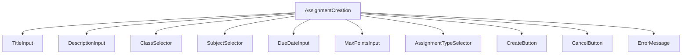
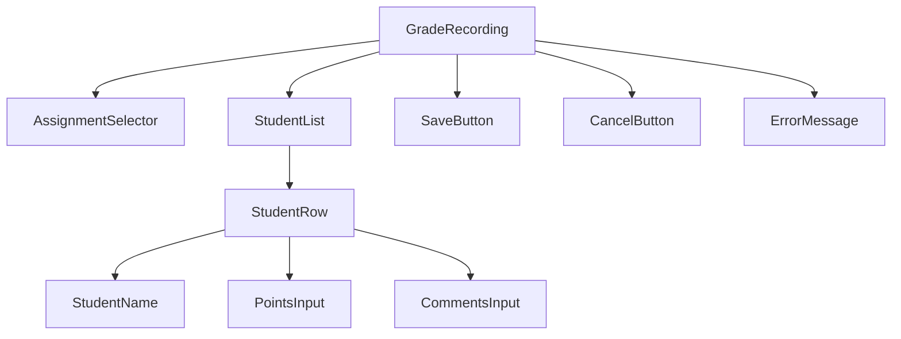
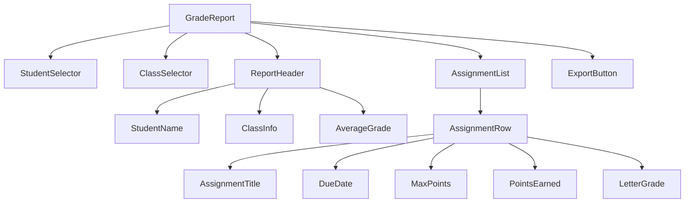

# Grade Management System with Assignment Tracking Plan

## 1. Feature Overview

The grade management system will allow teachers to create assignments, record student grades, and generate reports. Students and guardians will be able to view grades and track academic progress. The system will include assignment tracking, grade calculation, and reporting features.

## 2. Database Model Design

### 2.1 Assignment Model
```typescript
interface Assignment {
  id: string;
  title: string;
  description: string;
  classId: string;
  subjectId: string;
  assignedDate: Date;
  dueDate: Date;
  maxPoints: number;
  assignmentType: 'homework' | 'quiz' | 'test' | 'project' | 'exam';
  createdBy: string; // User ID of the teacher who created the assignment
  createdAt: Date;
  updatedAt: Date;
}
```

### 2.2 Grade Model
```typescript
interface Grade {
  id: string;
  studentId: string;
  assignmentId: string;
  points: number;
  letterGrade: string;
  comments: string;
  gradedBy: string; // User ID of the teacher who graded
  gradedDate: Date;
  createdAt: Date;
  updatedAt: Date;
}
```

### 2.3 Database Schemas (Mongoose)

#### Assignment Schema
```typescript
const assignmentSchema = new mongoose.Schema({
  title: {
    type: String,
    required: true,
    trim: true
  },
  description: {
    type: String,
    required: true
  },
  classId: {
    type: mongoose.Schema.Types.ObjectId,
    ref: 'Class',
    required: true
  },
  subjectId: {
    type: mongoose.Schema.Types.ObjectId,
    ref: 'Subject',
    required: true
  },
  assignedDate: {
    type: Date,
    required: true,
    default: Date.now
  },
  dueDate: {
    type: Date,
    required: true
  },
  maxPoints: {
    type: Number,
    required: true,
    min: 1
  },
  assignmentType: {
    type: String,
    enum: ['homework', 'quiz', 'test', 'project', 'exam'],
    required: true
  },
  createdBy: {
    type: mongoose.Schema.Types.ObjectId,
    ref: 'User',
    required: true
  }
}, {
  timestamps: true
});
```

#### Grade Schema
```typescript
const gradeSchema = new mongoose.Schema({
  studentId: {
    type: mongoose.Schema.Types.ObjectId,
    ref: 'Student',
    required: true
  },
  assignmentId: {
    type: mongoose.Schema.Types.ObjectId,
    ref: 'Assignment',
    required: true
  },
  points: {
    type: Number,
    required: true,
    min: 0
  },
  letterGrade: {
    type: String,
    enum: ['A+', 'A', 'A-', 'B+', 'B', 'B-', 'C+', 'C', 'C-', 'D+', 'D', 'F']
  },
  comments: {
    type: String
  },
  gradedBy: {
    type: mongoose.Schema.Types.ObjectId,
    ref: 'User',
    required: true
  },
  gradedDate: {
    type: Date,
    default: Date.now
  }
}, {
  timestamps: true
});

// Calculate letter grade before saving
gradeSchema.pre('save', function(next) {
  if (this.points !== undefined && this.assignmentId) {
    // Get assignment to calculate percentage
    Assignment.findById(this.assignmentId).then(assignment => {
      if (assignment) {
        const percentage = (this.points / assignment.maxPoints) * 100;
        this.letterGrade = this.calculateLetterGrade(percentage);
      }
      next();
    }).catch(err => {
      next(err);
    });
  } else {
    next();
  }
});

// Helper method to calculate letter grade
gradeSchema.methods.calculateLetterGrade = function(percentage: number) {
  if (percentage >= 97) return 'A+';
  if (percentage >= 93) return 'A';
  if (percentage >= 90) return 'A-';
  if (percentage >= 87) return 'B+';
  if (percentage >= 83) return 'B';
  if (percentage >= 80) return 'B-';
  if (percentage >= 77) return 'C+';
  if (percentage >= 73) return 'C';
  if (percentage >= 70) return 'C-';
  if (percentage >= 67) return 'D+';
  if (percentage >= 65) return 'D';
  return 'F';
};
```

## 3. API Endpoints

### 3.1 Assignment Routes
```
GET    /api/assignments                    - Get all assignments
GET    /api/assignments/:id                - Get assignment by ID
GET    /api/assignments/class/:classId     - Get assignments by class
GET    /api/assignments/subject/:subjectId - Get assignments by subject
POST   /api/assignments                    - Create new assignment
PUT    /api/assignments/:id                - Update assignment
DELETE /api/assignments/:id                - Delete assignment
```

### 3.2 Grade Routes
```
GET    /api/grades                          - Get all grades
GET    /api/grades/:id                      - Get grade by ID
GET    /api/grades/student/:studentId       - Get grades by student
GET    /api/grades/assignment/:assignmentId - Get grades by assignment
GET    /api/grades/class/:classId           - Get grades by class
POST   /api/grades                          - Record grade
PUT    /api/grades/:id                      - Update grade
DELETE /api/grades/:id                      - Delete grade
```

### 3.3 Request/Response Examples

#### Create Assignment (POST /api/assignments)
```json
// Request Body
{
  "title": "Math Quiz 1",
  "description": "Basic algebra quiz covering chapters 1-3",
  "classId": "class123",
  "subjectId": "subject456",
  "dueDate": "2023-06-20",
  "maxPoints": 100,
  "assignmentType": "quiz"
}

// Response
{
  "success": true,
  "data": {
    "id": "assignment789",
    "title": "Math Quiz 1",
    "description": "Basic algebra quiz covering chapters 1-3",
    "classId": "class123",
    "subjectId": "subject456",
    "assignedDate": "2023-06-15T00:00:00.000Z",
    "dueDate": "2023-06-20T00:00:00.000Z",
    "maxPoints": 100,
    "assignmentType": "quiz",
    "createdBy": "teacher123",
    "createdAt": "2023-06-15T08:30:00.000Z",
    "updatedAt": "2023-06-15T08:30:00.000Z"
  }
}
```

#### Record Grade (POST /api/grades)
```json
// Request Body
{
  "studentId": "student123",
  "assignmentId": "assignment789",
  "points": 85,
  "comments": "Good work, but needs improvement on problem 3"
}

// Response
{
  "success": true,
  "data": {
    "id": "grade999",
    "studentId": "student123",
    "assignmentId": "assignment789",
    "points": 85,
    "letterGrade": "B",
    "comments": "Good work, but needs improvement on problem 3",
    "gradedBy": "teacher123",
    "gradedDate": "2023-06-15T08:30:00.000Z",
    "createdAt": "2023-06-15T08:30:00.000Z",
    "updatedAt": "2023-06-15T08:30:00.000Z"
  }
}
```

## 4. Backend Implementation

### 4.1 Assignment Controller
```typescript
// assignmentController.ts
class AssignmentController {
  // Get all assignments
  async getAllAssignments(req: Request, res: Response) {
    try {
      const { classId, subjectId } = req.query;
      const filter: any = {};
      
      if (classId) filter.classId = classId;
      if (subjectId) filter.subjectId = subjectId;
      
      const assignments = await Assignment.find(filter)
        .populate('classId', 'name')
        .populate('subjectId', 'name')
        .populate('createdBy', 'firstName lastName');
      
      res.status(200).json({
        success: true,
        data: assignments,
        count: assignments.length
      });
    } catch (error) {
      res.status(500).json({
        success: false,
        message: 'Internal server error'
      });
    }
  }

  // Get assignment by ID
  async getAssignmentById(req: Request, res: Response) {
    try {
      const assignment = await Assignment.findById(req.params.id)
        .populate('classId', 'name')
        .populate('subjectId', 'name')
        .populate('createdBy', 'firstName lastName');
      
      if (!assignment) {
        return res.status(404).json({
          success: false,
          message: 'Assignment not found'
        });
      }
      
      res.status(200).json({
        success: true,
        data: assignment
      });
    } catch (error) {
      res.status(500).json({
        success: false,
        message: 'Internal server error'
      });
    }
  }

  // Create new assignment
  async createAssignment(req: Request, res: Response) {
    try {
      const { title, description, classId, subjectId, dueDate, maxPoints, assignmentType } = req.body;
      
      const assignment = new Assignment({
        title,
        description,
        classId,
        subjectId,
        dueDate,
        maxPoints,
        assignmentType,
        createdBy: req.userId
      });
      
      await assignment.save();
      
      // Populate references
      await assignment.populate('classId', 'name');
      await assignment.populate('subjectId', 'name');
      await assignment.populate('createdBy', 'firstName lastName');
      
      res.status(201).json({
        success: true,
        data: assignment
      });
    } catch (error) {
      res.status(500).json({
        success: false,
        message: 'Internal server error'
      });
    }
  }

  // Update assignment
  async updateAssignment(req: Request, res: Response) {
    try {
      const { title, description, dueDate, maxPoints } = req.body;
      
      const assignment = await Assignment.findByIdAndUpdate(
        req.params.id,
        { title, description, dueDate, maxPoints },
        { new: true, runValidators: true }
      )
        .populate('classId', 'name')
        .populate('subjectId', 'name')
        .populate('createdBy', 'firstName lastName');
      
      if (!assignment) {
        return res.status(404).json({
          success: false,
          message: 'Assignment not found'
        });
      }
      
      res.status(200).json({
        success: true,
        data: assignment
      });
    } catch (error) {
      res.status(500).json({
        success: false,
        message: 'Internal server error'
      });
    }
  }

  // Delete assignment
  async deleteAssignment(req: Request, res: Response) {
    try {
      const assignment = await Assignment.findByIdAndDelete(req.params.id);
      
      if (!assignment) {
        return res.status(404).json({
          success: false,
          message: 'Assignment not found'
        });
      }
      
      // Also delete associated grades
      await Grade.deleteMany({ assignmentId: req.params.id });
      
      res.status(200).json({
        success: true,
        message: 'Assignment deleted successfully'
      });
    } catch (error) {
      res.status(500).json({
        success: false,
        message: 'Internal server error'
      });
    }
  }
}
```

### 4.2 Grade Controller
```typescript
// gradeController.ts
class GradeController {
  // Get all grades
  async getAllGrades(req: Request, res: Response) {
    try {
      const { studentId, assignmentId, classId } = req.query;
      const filter: any = {};
      
      if (studentId) filter.studentId = studentId;
      if (assignmentId) filter.assignmentId = assignmentId;
      if (classId) {
        // Get assignments for the class first
        const assignments = await Assignment.find({ classId });
        const assignmentIds = assignments.map(a => a.id);
        filter.assignmentId = { $in: assignmentIds };
      }
      
      const grades = await Grade.find(filter)
        .populate('studentId', 'firstName lastName')
        .populate('assignmentId', 'title')
        .populate('gradedBy', 'firstName lastName');
      
      res.status(200).json({
        success: true,
        data: grades,
        count: grades.length
      });
    } catch (error) {
      res.status(500).json({
        success: false,
        message: 'Internal server error'
      });
    }
  }

  // Record grade
  async recordGrade(req: Request, res: Response) {
    try {
      const { studentId, assignmentId, points, comments } = req.body;
      
      // Check if grade already exists for this student and assignment
      const existingGrade = await Grade.findOne({ studentId, assignmentId });
      
      let grade;
      if (existingGrade) {
        // Update existing grade
        grade = await Grade.findByIdAndUpdate(
          existingGrade.id,
          { points, comments, gradedBy: req.userId, gradedDate: new Date() },
          { new: true, runValidators: true }
        );
      } else {
        // Create new grade
        grade = new Grade({
          studentId,
          assignmentId,
          points,
          comments,
          gradedBy: req.userId
        });
        await grade.save();
      }
      
      // Populate references
      await grade.populate('studentId', 'firstName lastName');
      await grade.populate('assignmentId', 'title');
      await grade.populate('gradedBy', 'firstName lastName');
      
      res.status(201).json({
        success: true,
        data: grade
      });
    } catch (error) {
      res.status(500).json({
        success: false,
        message: 'Internal server error'
      });
    }
  }

  // Update grade
  async updateGrade(req: Request, res: Response) {
    try {
      const { points, comments } = req.body;
      
      const grade = await Grade.findByIdAndUpdate(
        req.params.id,
        { points, comments, gradedBy: req.userId, gradedDate: new Date() },
        { new: true, runValidators: true }
      )
        .populate('studentId', 'firstName lastName')
        .populate('assignmentId', 'title')
        .populate('gradedBy', 'firstName lastName');
      
      if (!grade) {
        return res.status(404).json({
          success: false,
          message: 'Grade not found'
        });
      }
      
      res.status(200).json({
        success: true,
        data: grade
      });
    } catch (error) {
      res.status(500).json({
        success: false,
        message: 'Internal server error'
      });
    }
  }

  // Delete grade
  async deleteGrade(req: Request, res: Response) {
    try {
      const grade = await Grade.findByIdAndDelete(req.params.id);
      
      if (!grade) {
        return res.status(404).json({
          success: false,
          message: 'Grade not found'
        });
      }
      
      res.status(200).json({
        success: true,
        message: 'Grade deleted successfully'
      });
    } catch (error) {
      res.status(500).json({
        success: false,
        message: 'Internal server error'
      });
    }
  }
}
```

### 4.3 Grade Service
```typescript
// gradeService.ts
class GradeService {
  // Calculate student's average grade for a class
  async calculateStudentAverage(studentId: string, classId: string) {
    try {
      // Get assignments for the class
      const assignments = await Assignment.find({ classId });
      const assignmentIds = assignments.map(a => a.id);
      
      // Get grades for the student in those assignments
      const grades = await Grade.find({
        studentId,
        assignmentId: { $in: assignmentIds }
      });
      
      if (grades.length === 0) return 0;
      
      // Calculate weighted average
      let totalPoints = 0;
      let totalMaxPoints = 0;
      
      for (const grade of grades) {
        const assignment = assignments.find(a => a.id === grade.assignmentId.toString());
        if (assignment) {
          totalPoints += grade.points;
          totalMaxPoints += assignment.maxPoints;
        }
      }
      
      return totalMaxPoints > 0 ? (totalPoints / totalMaxPoints) * 100 : 0;
    } catch (error) {
      throw new Error('Failed to calculate student average');
    }
  }

  // Generate grade report for a student
  async generateStudentReport(studentId: string, classId: string) {
    try {
      const student = await Student.findById(studentId);
      const classObj = await Class.findById(classId);
      
      if (!student || !classObj) {
        throw new Error('Student or class not found');
      }
      
      // Get assignments for the class
      const assignments = await Assignment.find({ classId })
        .sort({ dueDate: 1 });
      
      // Get grades for the student
      const grades = await Grade.find({
        studentId,
        assignmentId: { $in: assignments.map(a => a.id) }
      })
        .populate('assignmentId', 'title maxPoints dueDate assignmentType');
      
      // Calculate average
      const average = await this.calculateStudentAverage(studentId, classId);
      
      return {
        student: {
          id: student.id,
          firstName: student.firstName,
          lastName: student.lastName
        },
        class: {
          id: classObj.id,
          name: classObj.name
        },
        assignments: assignments.map(assignment => {
          const grade = grades.find(g => g.assignmentId.toString() === assignment.id);
          return {
            id: assignment.id,
            title: assignment.title,
            dueDate: assignment.dueDate,
            maxPoints: assignment.maxPoints,
            assignmentType: assignment.assignmentType,
            points: grade ? grade.points : null,
            letterGrade: grade ? grade.letterGrade : null,
            gradedDate: grade ? grade.gradedDate : null
          };
        }),
        average: average,
        letterGrade: this.calculateLetterGrade(average)
      };
    } catch (error) {
      throw new Error('Failed to generate student report');
    }
  }

  // Calculate letter grade from percentage
  calculateLetterGrade(percentage: number) {
    if (percentage >= 97) return 'A+';
    if (percentage >= 93) return 'A';
    if (percentage >= 90) return 'A-';
    if (percentage >= 87) return 'B+';
    if (percentage >= 83) return 'B';
    if (percentage >= 80) return 'B-';
    if (percentage >= 77) return 'C+';
    if (percentage >= 73) return 'C';
    if (percentage >= 70) return 'C-';
    if (percentage >= 67) return 'D+';
    if (percentage >= 65) return 'D';
    return 'F';
  }

  // Generate class grade report
  async generateClassReport(classId: string) {
    try {
      const classObj = await Class.findById(classId);
      if (!classObj) {
        throw new Error('Class not found');
      }
      
      // Get students in the class
      const students = await Student.find({ classId });
      
      // Get assignments for the class
      const assignments = await Assignment.find({ classId })
        .sort({ dueDate: 1 });
      
      // Get all grades for the class
      const grades = await Grade.find({
        assignmentId: { $in: assignments.map(a => a.id) }
      });
      
      // Calculate averages for each student
      const studentReports = await Promise.all(
        students.map(async student => {
          const average = await this.calculateStudentAverage(student.id, classId);
          return {
            student: {
              id: student.id,
              firstName: student.firstName,
              lastName: student.lastName
            },
            average: average,
            letterGrade: this.calculateLetterGrade(average)
          };
        })
      );
      
      return {
        class: {
          id: classObj.id,
          name: classObj.name
        },
        assignments: assignments.map(assignment => ({
          id: assignment.id,
          title: assignment.title,
          dueDate: assignment.dueDate,
          maxPoints: assignment.maxPoints,
          assignmentType: assignment.assignmentType
        })),
        students: studentReports,
        classAverage: studentReports.length > 0 
          ? studentReports.reduce((sum, report) => sum + report.average, 0) / studentReports.length
          : 0
      };
    } catch (error) {
      throw new Error('Failed to generate class report');
    }
  }
}
```

## 5. Frontend Implementation

### 5.1 UI Components

#### Assignment Creation Component


#### Grade Recording Component


#### Grade Report Component


### 5.2 Page Components

#### Assignment Management Pages
- Assignment List Page
- Create Assignment Page
- Edit Assignment Page
- Assignment Details Page

#### Grade Management Pages
- Grade Book Page
- Record Grades Page
- Student Grade Report Page
- Class Grade Report Page

### 5.3 Redux State Management

#### Grade Slice
```typescript
// gradeSlice.ts
interface GradeState {
  assignments: Assignment[];
  grades: Grade[];
  currentAssignment: Assignment | null;
  currentGrade: Grade | null;
  loading: boolean;
  error: string | null;
  filters: {
    classId: string | null;
    subjectId: string | null;
    studentId: string | null;
  };
}

const gradeSlice = createSlice({
  name: 'grade',
  initialState,
  reducers: {
    setAssignments(state, action) {
      state.assignments = action.payload;
    },
    setGrades(state, action) {
      state.grades = action.payload;
    },
    addAssignment(state, action) {
      state.assignments.push(action.payload);
    },
    updateAssignment(state, action) {
      const index = state.assignments.findIndex(a => a.id === action.payload.id);
      if (index !== -1) {
        state.assignments[index] = action.payload;
      }
    },
    deleteAssignment(state, action) {
      state.assignments = state.assignments.filter(a => a.id !== action.payload);
    },
    addGrade(state, action) {
      state.grades.push(action.payload);
    },
    updateGrade(state, action) {
      const index = state.grades.findIndex(g => g.id === action.payload.id);
      if (index !== -1) {
        state.grades[index] = action.payload;
      }
    },
    deleteGrade(state, action) {
      state.grades = state.grades.filter(g => g.id !== action.payload);
    },
    setLoading(state, action) {
      state.loading = action.payload;
    },
    setError(state, action) {
      state.error = action.payload;
    }
  }
});

// Async thunks
export const fetchAssignments = createAsyncThunk(
  'grade/fetchAssignments',
  async (filters: { classId?: string; subjectId?: string }, { rejectWithValue }) => {
    try {
      const response = await gradeApi.getAssignments(filters);
      return response.data;
    } catch (error) {
      return rejectWithValue(error.response.data.message);
    }
  }
);

export const createAssignment = createAsyncThunk(
  'grade/createAssignment',
  async (assignmentData: AssignmentData, { rejectWithValue }) => {
    try {
      const response = await gradeApi.createAssignment(assignmentData);
      return response.data;
    } catch (error) {
      return rejectWithValue(error.response.data.message);
    }
  }
);

export const recordGrade = createAsyncThunk(
  'grade/recordGrade',
  async (gradeData: GradeData, { rejectWithValue }) => {
    try {
      const response = await gradeApi.recordGrade(gradeData);
      return response.data;
    } catch (error) {
      return rejectWithValue(error.response.data.message);
    }
  }
);
```

## 6. API Service Integration

### 6.1 Grade API Service
```typescript
// gradeApi.ts
class GradeApi {
  // Get assignments
  static async getAssignments(filters: { classId?: string; subjectId?: string }) {
    const queryParams = new URLSearchParams();
    if (filters.classId) queryParams.append('classId', filters.classId);
    if (filters.subjectId) queryParams.append('subjectId', filters.subjectId);
    
    return await api.get(`/assignments?${queryParams.toString()}`);
  }

  // Create assignment
  static async createAssignment(assignmentData: AssignmentData) {
    return await api.post('/assignments', assignmentData);
  }

  // Update assignment
  static async updateAssignment(id: string, assignmentData: Partial<Assignment>) {
    return await api.put(`/assignments/${id}`, assignmentData);
  }

  // Delete assignment
  static async deleteAssignment(id: string) {
    return await api.delete(`/assignments/${id}`);
  }

  // Get grades
  static async getGrades(filters: { studentId?: string; assignmentId?: string; classId?: string }) {
    const queryParams = new URLSearchParams();
    if (filters.studentId) queryParams.append('studentId', filters.studentId);
    if (filters.assignmentId) queryParams.append('assignmentId', filters.assignmentId);
    if (filters.classId) queryParams.append('classId', filters.classId);
    
    return await api.get(`/grades?${queryParams.toString()}`);
  }

  // Record grade
  static async recordGrade(gradeData: GradeData) {
    return await api.post('/grades', gradeData);
  }

  // Update grade
  static async updateGrade(id: string, gradeData: Partial<Grade>) {
    return await api.put(`/grades/${id}`, gradeData);
  }

  // Delete grade
  static async deleteGrade(id: string) {
    return await api.delete(`/grades/${id}`);
  }

  // Generate student report
  static async generateStudentReport(studentId: string, classId: string) {
    return await api.get(`/reports/student/${studentId}/class/${classId}`);
  }

  // Generate class report
  static async generateClassReport(classId: string) {
    return await api.get(`/reports/class/${classId}`);
  }
}
```

## 7. Business Logic and Validation

### 7.1 Validation Rules
- Assignment due date must be in the future
- Max points must be greater than 0
- Points earned cannot exceed max points
- Each student can only have one grade per assignment
- Only teachers can create assignments and record grades

### 7.2 Business Rules
- Automatically calculate letter grades based on percentage
- Prevent modification of grades older than 30 days (configurable)
- Generate grade warnings for students with low grades
- Audit trail for all grade modifications

## 8. Reporting Features

### 8.1 Grade Reports
- Individual student grade reports
- Class grade reports
- Subject grade reports
- Progress tracking over time

### 8.2 Export Options
- PDF export of grade reports
- Excel export of grade data
- CSV export for importing into other systems

## 9. Security Considerations

- Role-based access control (only teachers can create assignments and record grades)
- Input validation and sanitization
- Rate limiting for API endpoints
- Audit logging for all grade operations

## 10. Performance Optimization

- Database indexing on frequently queried fields (studentId, assignmentId, classId)
- Pagination for large grade datasets
- Caching of frequently accessed grade summaries
- Efficient querying for grade reports