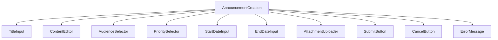
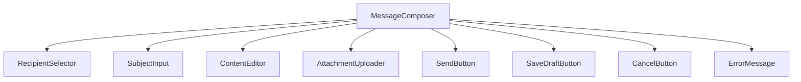
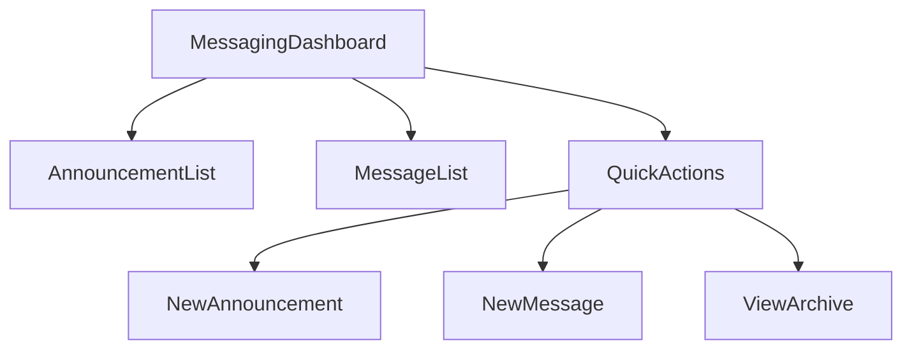

# Messaging and Announcements System Plan

## 1. Feature Overview

The messaging and announcements system will allow administrators and teachers to communicate important information to students, parents, and staff. The system will support both general announcements and direct messaging between users.

## 2. Database Model Design

### 2.1 Announcement Model
```typescript
interface Announcement {
  id: string;
  title: string;
  content: string;
  authorId: string;
  targetAudience: 'all' | 'students' | 'teachers' | 'parents';
  priority: 'low' | 'medium' | 'high';
  startDate: Date;
  endDate: Date;
  attachments: string[];
  createdAt: Date;
  updatedAt: Date;
}
```

### 2.2 Message Model
```typescript
interface Message {
  id: string;
  senderId: string;
  recipientId: string;
  subject: string;
  content: string;
  read: boolean;
  parentId: string; // For threading replies
  attachments: string[];
  createdAt: Date;
  updatedAt: Date;
}
```

### 2.3 Database Schemas (Mongoose)

#### Announcement Schema
```typescript
const announcementSchema = new mongoose.Schema({
  title: {
    type: String,
    required: true,
    trim: true
  },
  content: {
    type: String,
    required: true
  },
  authorId: {
    type: mongoose.Schema.Types.ObjectId,
    ref: 'User',
    required: true
  },
  targetAudience: {
    type: String,
    required: true,
    enum: ['all', 'students', 'teachers', 'parents']
  },
  priority: {
    type: String,
    default: 'medium',
    enum: ['low', 'medium', 'high']
  },
  startDate: {
    type: Date,
    default: Date.now
  },
  endDate: {
    type: Date,
    required: false
  },
  attachments: {
    type: [String],
    required: false
  }
}, {
  timestamps: true
});

// Indexes for better query performance
announcementSchema.index({ authorId: 1 });
announcementSchema.index({ targetAudience: 1 });
announcementSchema.index({ priority: 1 });
announcementSchema.index({ startDate: 1 });
announcementSchema.index({ endDate: 1 });

export default mongoose.model('Announcement', announcementSchema);
```

#### Message Schema
```typescript
const messageSchema = new mongoose.Schema({
  senderId: {
    type: mongoose.Schema.Types.ObjectId,
    ref: 'User',
    required: true
  },
  recipientId: {
    type: mongoose.Schema.Types.ObjectId,
    ref: 'User',
    required: true
  },
  subject: {
    type: String,
    required: true,
    trim: true
  },
  content: {
    type: String,
    required: true
  },
  read: {
    type: Boolean,
    default: false
  },
  parentId: {
    type: mongoose.Schema.Types.ObjectId,
    ref: 'Message',
    required: false
  },
  attachments: {
    type: [String],
    required: false
  }
}, {
  timestamps: true
});

// Indexes for better query performance
messageSchema.index({ senderId: 1 });
messageSchema.index({ recipientId: 1 });
messageSchema.index({ read: 1 });
messageSchema.index({ parentId: 1 });
messageSchema.index({ createdAt: -1 });

export default mongoose.model('Message', messageSchema);
```

## 3. API Endpoints

### 3.1 Announcement Routes
```
GET    /api/announcements                    - Get all announcements
GET    /api/announcements/:id                - Get announcement by ID
GET    /api/announcements/audience/:audience - Get announcements for specific audience
POST   /api/announcements                    - Create new announcement
PUT    /api/announcements/:id                - Update announcement
DELETE /api/announcements/:id                - Delete announcement
```

### 3.2 Message Routes
```
GET    /api/messages                         - Get all messages for current user
GET    /api/messages/:id                     - Get message by ID
GET    /api/messages/thread/:parentId        - Get message thread
POST   /api/messages                         - Send new message
PUT    /api/messages/:id/read                - Mark message as read
DELETE /api/messages/:id                     - Delete message
```

### 3.3 Request/Response Examples

#### Create Announcement (POST /api/announcements)
```json
// Request Body
{
  "title": "School Closed for Holiday",
  "content": "The school will be closed on Monday, July 4th for Independence Day holiday.",
  "targetAudience": "all",
  "priority": "high",
  "startDate": "2023-06-20",
  "endDate": "2023-07-05"
}

// Response
{
  "success": true,
  "data": {
    "id": "announcement999",
    "title": "School Closed for Holiday",
    "content": "The school will be closed on Monday, July 4th for Independence Day holiday.",
    "authorId": "user123",
    "targetAudience": "all",
    "priority": "high",
    "startDate": "2023-06-20T00:00:00.000Z",
    "endDate": "2023-07-05T00:00:00.000Z",
    "attachments": [],
    "createdAt": "2023-06-20T08:30:00.000Z",
    "updatedAt": "2023-06-20T08:30:00.000Z"
  }
}
```

#### Send Message (POST /api/messages)
```json
// Request Body
{
  "recipientId": "user456",
  "subject": "Question about Assignment",
  "content": "Hi, I had a question about the math assignment due tomorrow."
}

// Response
{
  "success": true,
  "data": {
    "id": "message888",
    "senderId": "user123",
    "recipientId": "user456",
    "subject": "Question about Assignment",
    "content": "Hi, I had a question about the math assignment due tomorrow.",
    "read": false,
    "parentId": null,
    "attachments": [],
    "createdAt": "2023-06-20T08:30:00.000Z",
    "updatedAt": "2023-06-20T08:30:00.000Z"
  }
}
```

## 4. Backend Implementation

### 4.1 Announcement Controller
```typescript
// announcementController.ts
class AnnouncementController {
  // Get all announcements
  async getAllAnnouncements(req: Request, res: Response) {
    try {
      const { audience, priority, page = 1, limit = 10 } = req.query;
      
      const filter: any = {
        startDate: { $lte: new Date() },
        $or: [
          { endDate: { $exists: false } },
          { endDate: { $gte: new Date() } }
        ]
      };
      
      if (audience) filter.targetAudience = { $in: [audience, 'all'] };
      if (priority) filter.priority = priority;
      
      const announcements = await Announcement.find(filter)
        .populate('authorId', 'firstName lastName role')
        .limit(limit * 1)
        .skip((page - 1) * limit)
        .sort({ priority: -1, createdAt: -1 });
      
      const total = await Announcement.countDocuments(filter);
      
      res.status(200).json({
        success: true,
        data: announcements,
        pagination: {
          page: parseInt(page as string),
          limit: parseInt(limit as string),
          total,
          pages: Math.ceil(total / limit)
        }
      });
    } catch (error) {
      res.status(500).json({
        success: false,
        message: 'Internal server error'
      });
    }
  }

  // Get announcement by ID
  async getAnnouncementById(req: Request, res: Response) {
    try {
      const announcement = await Announcement.findById(req.params.id)
        .populate('authorId', 'firstName lastName role');
      
      if (!announcement) {
        return res.status(404).json({
          success: false,
          message: 'Announcement not found'
        });
      }
      
      // Check if announcement is active
      const now = new Date();
      if (announcement.startDate > now || (announcement.endDate && announcement.endDate < now)) {
        return res.status(404).json({
          success: false,
          message: 'Announcement not found or not active'
        });
      }
      
      res.status(200).json({
        success: true,
        data: announcement
      });
    } catch (error) {
      res.status(500).json({
        success: false,
        message: 'Internal server error'
      });
    }
  }

  // Get announcements for specific audience
  async getAnnouncementsForAudience(req: Request, res: Response) {
    try {
      const { audience } = req.params;
      const { page = 1, limit = 10 } = req.query;
      
      const filter = {
        targetAudience: { $in: [audience, 'all'] },
        startDate: { $lte: new Date() },
        $or: [
          { endDate: { $exists: false } },
          { endDate: { $gte: new Date() } }
        ]
      };
      
      const announcements = await Announcement.find(filter)
        .populate('authorId', 'firstName lastName role')
        .limit(limit * 1)
        .skip((page - 1) * limit)
        .sort({ priority: -1, createdAt: -1 });
      
      const total = await Announcement.countDocuments(filter);
      
      res.status(200).json({
        success: true,
        data: announcements,
        pagination: {
          page: parseInt(page as string),
          limit: parseInt(limit as string),
          total,
          pages: Math.ceil(total / limit)
        }
      });
    } catch (error) {
      res.status(500).json({
        success: false,
        message: 'Internal server error'
      });
    }
  }

  // Create new announcement
  async createAnnouncement(req: Request, res: Response) {
    try {
      const { title, content, targetAudience, priority, startDate, endDate, attachments } = req.body;
      
      const announcement = new Announcement({
        title,
        content,
        authorId: req.userId,
        targetAudience,
        priority,
        startDate,
        endDate,
        attachments
      });
      
      await announcement.save();
      
      // Populate references
      await announcement.populate('authorId', 'firstName lastName role');
      
      res.status(201).json({
        success: true,
        data: announcement
      });
    } catch (error) {
      res.status(500).json({
        success: false,
        message: 'Internal server error'
      });
    }
  }

  // Update announcement
  async updateAnnouncement(req: Request, res: Response) {
    try {
      const announcement = await Announcement.findByIdAndUpdate(
        req.params.id,
        req.body,
        { new: true, runValidators: true }
      )
        .populate('authorId', 'firstName lastName role');
      
      if (!announcement) {
        return res.status(404).json({
          success: false,
          message: 'Announcement not found'
        });
      }
      
      res.status(200).json({
        success: true,
        data: announcement
      });
    } catch (error) {
      res.status(500).json({
        success: false,
        message: 'Internal server error'
      });
    }
  }

  // Delete announcement
  async deleteAnnouncement(req: Request, res: Response) {
    try {
      const announcement = await Announcement.findByIdAndDelete(req.params.id);
      
      if (!announcement) {
        return res.status(404).json({
          success: false,
          message: 'Announcement not found'
        });
      }
      
      res.status(200).json({
        success: true,
        message: 'Announcement deleted successfully'
      });
    } catch (error) {
      res.status(500).json({
        success: false,
        message: 'Internal server error'
      });
    }
  }
}
```

### 4.2 Message Controller
```typescript
// messageController.ts
class MessageController {
  // Get all messages for current user
  async getUserMessages(req: Request, res: Response) {
    try {
      const { folder = 'inbox', page = 1, limit = 10 } = req.query;
      
      const filter: any = {};
      
      if (folder === 'inbox') {
        filter.recipientId = req.userId;
      } else if (folder === 'sent') {
        filter.senderId = req.userId;
      }
      
      const messages = await Message.find(filter)
        .populate('senderId', 'firstName lastName role')
        .populate('recipientId', 'firstName lastName role')
        .limit(limit * 1)
        .skip((page - 1) * limit)
        .sort({ createdAt: -1 });
      
      const total = await Message.countDocuments(filter);
      
      res.status(200).json({
        success: true,
        data: messages,
        pagination: {
          page: parseInt(page as string),
          limit: parseInt(limit as string),
          total,
          pages: Math.ceil(total / limit)
        }
      });
    } catch (error) {
      res.status(500).json({
        success: false,
        message: 'Internal server error'
      });
    }
  }

  // Get message by ID
  async getMessageById(req: Request, res: Response) {
    try {
      const message = await Message.findById(req.params.id)
        .populate('senderId', 'firstName lastName role')
        .populate('recipientId', 'firstName lastName role');
      
      if (!message) {
        return res.status(404).json({
          success: false,
          message: 'Message not found'
        });
      }
      
      // Check if user has permission to view this message
      if (message.senderId.toString() !== req.userId && message.recipientId.toString() !== req.userId) {
        return res.status(403).json({
          success: false,
          message: 'Access denied'
        });
      }
      
      // Mark as read if recipient is viewing
      if (message.recipientId.toString() === req.userId && !message.read) {
        message.read = true;
        await message.save();
      }
      
      res.status(200).json({
        success: true,
        data: message
      });
    } catch (error) {
      res.status(500).json({
        success: false,
        message: 'Internal server error'
      });
    }
  }

  // Get message thread
  async getMessageThread(req: Request, res: Response) {
    try {
      const { parentId } = req.params;
      
      // Get the parent message
      const parentMessage = await Message.findById(parentId);
      if (!parentMessage) {
        return res.status(404).json({
          success: false,
          message: 'Parent message not found'
        });
      }
      
      // Get all messages in the thread
      const threadMessages = await Message.find({
        $or: [
          { _id: parentId },
          { parentId: parentId }
        ]
      })
        .populate('senderId', 'firstName lastName role')
        .populate('recipientId', 'firstName lastName role')
        .sort({ createdAt: 1 });
      
      res.status(200).json({
        success: true,
        data: threadMessages
      });
    } catch (error) {
      res.status(500).json({
        success: false,
        message: 'Internal server error'
      });
    }
  }

  // Send new message
  async sendMessage(req: Request, res: Response) {
    try {
      const { recipientId, subject, content, parentId, attachments } = req.body;
      
      // Check if recipient exists
      const recipient = await User.findById(recipientId);
      if (!recipient) {
        return res.status(404).json({
          success: false,
          message: 'Recipient not found'
        });
      }
      
      const message = new Message({
        senderId: req.userId,
        recipientId,
        subject,
        content,
        parentId,
        attachments
      });
      
      await message.save();
      
      // Populate references
      await message.populate('senderId', 'firstName lastName role');
      await message.populate('recipientId', 'firstName lastName role');
      
      res.status(201).json({
        success: true,
        data: message
      });
    } catch (error) {
      res.status(500).json({
        success: false,
        message: 'Internal server error'
      });
    }
  }

  // Mark message as read
  async markMessageAsRead(req: Request, res: Response) {
    try {
      const message = await Message.findById(req.params.id);
      
      if (!message) {
        return res.status(404).json({
          success: false,
          message: 'Message not found'
        });
      }
      
      // Check if user is the recipient
      if (message.recipientId.toString() !== req.userId) {
        return res.status(403).json({
          success: false,
          message: 'Access denied'
        });
      }
      
      message.read = true;
      await message.save();
      
      res.status(200).json({
        success: true,
        message: 'Message marked as read'
      });
    } catch (error) {
      res.status(500).json({
        success: false,
        message: 'Internal server error'
      });
    }
  }

  // Delete message
  async deleteMessage(req: Request, res: Response) {
    try {
      const message = await Message.findById(req.params.id);
      
      if (!message) {
        return res.status(404).json({
          success: false,
          message: 'Message not found'
        });
      }
      
      // Check if user has permission to delete this message
      if (message.senderId.toString() !== req.userId && message.recipientId.toString() !== req.userId) {
        return res.status(403).json({
          success: false,
          message: 'Access denied'
        });
      }
      
      await message.remove();
      
      res.status(200).json({
        success: true,
        message: 'Message deleted successfully'
      });
    } catch (error) {
      res.status(500).json({
        success: false,
        message: 'Internal server error'
      });
    }
  }

  // Get message statistics
  async getMessageStats(req: Request, res: Response) {
    try {
      const inboxCount = await Message.countDocuments({
        recipientId: req.userId,
        read: false
      });
      
      const sentCount = await Message.countDocuments({
        senderId: req.userId
      });
      
      res.status(200).json({
        success: true,
        data: {
          unread: inboxCount,
          sent: sentCount
        }
      });
    } catch (error) {
      res.status(500).json({
        success: false,
        message: 'Internal server error'
      });
    }
  }
}
```

### 4.3 Messaging Service
```typescript
// messagingService.ts
class MessagingService {
  // Send announcement to multiple users
  async sendAnnouncementToUsers(announcementId: string, userIds: string[]) {
    try {
      // In a real implementation, we would send notifications to users
      // This could be email notifications, push notifications, etc.
      
      // For now, we'll just return the announcement and user count
      const announcement = await Announcement.findById(announcementId);
      if (!announcement) {
        throw new Error('Announcement not found');
      }
      
      return {
        announcement,
        recipients: userIds.length
      };
    } catch (error) {
      throw new Error('Failed to send announcement to users');
    }
  }

  // Get user's unread message count
  async getUnreadMessageCount(userId: string) {
    try {
      const count = await Message.countDocuments({
        recipientId: userId,
        read: false
      });
      
      return count;
    } catch (error) {
      throw new Error('Failed to get unread message count');
    }
  }

  // Get recent announcements for a user
  async getRecentAnnouncementsForUser(userRole: string, limit: number = 5) {
    try {
      const filter = {
        targetAudience: { $in: [userRole, 'all'] },
        startDate: { $lte: new Date() },
        $or: [
          { endDate: { $exists: false } },
          { endDate: { $gte: new Date() } }
        ]
      };
      
      const announcements = await Announcement.find(filter)
        .populate('authorId', 'firstName lastName role')
        .sort({ priority: -1, createdAt: -1 })
        .limit(limit);
      
      return announcements;
    } catch (error) {
      throw new Error('Failed to get recent announcements');
    }
  }

  // Archive old messages
  async archiveOldMessages(days: number = 30) {
    try {
      const cutoffDate = new Date();
      cutoffDate.setDate(cutoffDate.getDate() - days);
      
      // In a real implementation, we would move old messages to an archive collection
      // For now, we'll just return the count of messages that would be archived
      
      const count = await Message.countDocuments({
        createdAt: { $lt: cutoffDate }
      });
      
      return {
        archived: count,
        cutoffDate
      };
    } catch (error) {
      throw new Error('Failed to archive old messages');
    }
  }

  // Search messages
  async searchMessages(userId: string, query: string, folder: string = 'inbox') {
    try {
      const filter: any = {
        $text: { $search: query }
      };
      
      if (folder === 'inbox') {
        filter.recipientId = userId;
      } else if (folder === 'sent') {
        filter.senderId = userId;
      }
      
      const messages = await Message.find(filter)
        .populate('senderId', 'firstName lastName role')
        .populate('recipientId', 'firstName lastName role')
        .sort({ createdAt: -1 });
      
      return messages;
    } catch (error) {
      throw new Error('Failed to search messages');
    }
  }

  // Search announcements
  async searchAnnouncements(query: string) {
    try {
      const filter = {
        $text: { $search: query },
        startDate: { $lte: new Date() },
        $or: [
          { endDate: { $exists: false } },
          { endDate: { $gte: new Date() } }
        ]
      };
      
      const announcements = await Announcement.find(filter)
        .populate('authorId', 'firstName lastName role')
        .sort({ createdAt: -1 });
      
      return announcements;
    } catch (error) {
      throw new Error('Failed to search announcements');
    }
  }
}
```

## 5. Frontend Implementation

### 5.1 UI Components

#### Announcement Creation Component


#### Message Composer Component


#### Messaging Dashboard Component


### 5.2 Page Components

#### Announcement Management Pages
- Announcement List Page
- Create Announcement Page
- Edit Announcement Page
- Announcement Details Page

#### Messaging Pages
- Inbox Page
- Sent Messages Page
- Message Composition Page
- Message Thread Page

#### Notification Center
- Unread Messages Indicator
- Recent Announcements Widget
- Notification Preferences Page

### 5.3 Redux State Management

#### Messaging Slice
```typescript
// messagingSlice.ts
interface MessagingState {
  announcements: Announcement[];
  messages: Message[];
  currentAnnouncement: Announcement | null;
  currentMessage: Message | null;
  loading: boolean;
  error: string | null;
  filters: {
    audience: string | null;
    priority: string | null;
    folder: string;
  };
  stats: {
    unreadMessages: number;
    sentMessages: number;
  };
}

const messagingSlice = createSlice({
  name: 'messaging',
  initialState,
  reducers: {
    setAnnouncements(state, action) {
      state.announcements = action.payload;
    },
    setMessages(state, action) {
      state.messages = action.payload;
    },
    addAnnouncement(state, action) {
      state.announcements.unshift(action.payload);
    },
    updateAnnouncement(state, action) {
      const index = state.announcements.findIndex(announcement => announcement.id === action.payload.id);
      if (index !== -1) {
        state.announcements[index] = action.payload;
      }
    },
    deleteAnnouncement(state, action) {
      state.announcements = state.announcements.filter(announcement => announcement.id !== action.payload);
    },
    addMessage(state, action) {
      state.messages.unshift(action.payload);
    },
    updateMessage(state, action) {
      const index = state.messages.findIndex(message => message.id === action.payload.id);
      if (index !== -1) {
        state.messages[index] = action.payload;
      }
    },
    deleteMessage(state, action) {
      state.messages = state.messages.filter(message => message.id !== action.payload);
    },
    setStats(state, action) {
      state.stats = action.payload;
    },
    setLoading(state, action) {
      state.loading = action.payload;
    },
    setError(state, action) {
      state.error = action.payload;
    }
  }
});

// Async thunks
export const fetchAnnouncements = createAsyncThunk(
  'messaging/fetchAnnouncements',
  async (filters: { audience?: string; priority?: string }, { rejectWithValue }) => {
    try {
      const response = await messagingApi.getAnnouncements(filters);
      return response.data;
    } catch (error) {
      return rejectWithValue(error.response.data.message);
    }
  }
);

export const createAnnouncement = createAsyncThunk(
  'messaging/createAnnouncement',
  async (announcementData: AnnouncementData, { rejectWithValue }) => {
    try {
      const response = await messagingApi.createAnnouncement(announcementData);
      return response.data;
    } catch (error) {
      return rejectWithValue(error.response.data.message);
    }
  }
);

export const sendMessage = createAsyncThunk(
  'messaging/sendMessage',
  async (messageData: MessageData, { rejectWithValue }) => {
    try {
      const response = await messagingApi.sendMessage(messageData);
      return response.data;
    } catch (error) {
      return rejectWithValue(error.response.data.message);
    }
  }
);

export const fetchMessageStats = createAsyncThunk(
  'messaging/fetchMessageStats',
  async (_, { rejectWithValue }) => {
    try {
      const response = await messagingApi.getMessageStats();
      return response.data;
    } catch (error) {
      return rejectWithValue(error.response.data.message);
    }
  }
);
```

## 6. API Service Integration

### 6.1 Messaging API Service
```typescript
// messagingApi.ts
class MessagingApi {
  // Get announcements
  static async getAnnouncements(filters: { audience?: string; priority?: string; page?: number; limit?: number }) {
    const queryParams = new URLSearchParams();
    if (filters.audience) queryParams.append('audience', filters.audience);
    if (filters.priority) queryParams.append('priority', filters.priority);
    if (filters.page) queryParams.append('page', filters.page.toString());
    if (filters.limit) queryParams.append('limit', filters.limit.toString());
    
    return await api.get(`/announcements?${queryParams.toString()}`);
  }

  // Get announcements for specific audience
  static async getAnnouncementsForAudience(audience: string, page: number = 1, limit: number = 10) {
    return await api.get(`/announcements/audience/${audience}?page=${page}&limit=${limit}`);
  }

  // Create announcement
  static async createAnnouncement(announcementData: AnnouncementData) {
    return await api.post('/announcements', announcementData);
  }

  // Update announcement
  static async updateAnnouncement(id: string, announcementData: Partial<Announcement>) {
    return await api.put(`/announcements/${id}`, announcementData);
  }

  // Delete announcement
  static async deleteAnnouncement(id: string) {
    return await api.delete(`/announcements/${id}`);
  }

  // Get messages
  static async getMessages(folder: string = 'inbox', page: number = 1, limit: number = 10) {
    return await api.get(`/messages?folder=${folder}&page=${page}&limit=${limit}`);
  }

  // Get message by ID
  static async getMessageById(id: string) {
    return await api.get(`/messages/${id}`);
  }

  // Get message thread
  static async getMessageThread(parentId: string) {
    return await api.get(`/messages/thread/${parentId}`);
  }

  // Send message
  static async sendMessage(messageData: MessageData) {
    return await api.post('/messages', messageData);
  }

  // Mark message as read
  static async markMessageAsRead(id: string) {
    return await api.put(`/messages/${id}/read`);
  }

  // Delete message
  static async deleteMessage(id: string) {
    return await api.delete(`/messages/${id}`);
  }

  // Get message statistics
  static async getMessageStats() {
    return await api.get('/messages/stats');
  }

  // Search messages
  static async searchMessages(query: string, folder: string = 'inbox') {
    return await api.get(`/messages/search?q=${encodeURIComponent(query)}&folder=${folder}`);
  }

  // Search announcements
  static async searchAnnouncements(query: string) {
    return await api.get(`/announcements/search?q=${encodeURIComponent(query)}`);
  }
}
```

## 7. Business Logic and Validation

### 7.1 Validation Rules
- Announcement title must not be empty
- Announcement content must not be empty
- Target audience must be one of the allowed values
- Priority must be one of the allowed values
- End date must be after start date
- Message subject must not be empty
- Message content must not be empty
- Recipient must exist in the system

### 7.2 Business Rules
- Only administrators and teachers can create announcements
- Announcements are only visible during their active period
- Messages can be replied to, creating threads
- Users can only view messages they sent or received
- Unread message count is displayed in the UI
- High-priority announcements are highlighted

## 8. Notification Features

### 8.1 Real-time Notifications
- WebSocket connections for real-time message delivery
- Browser notifications for new announcements
- Email notifications for important announcements
- Push notifications for mobile devices

### 8.2 Notification Preferences
- Users can configure notification preferences
- Different notification channels (email, SMS, push)
- Frequency settings (immediate, daily digest, weekly summary)
- Mute options for specific types of notifications

## 9. Reporting Features

### 9.1 Communication Reports
- Announcement reach statistics
- Message volume reports
- User engagement metrics
- Response time analysis

### 9.2 Export Options
- PDF export of announcements
- Excel export of message logs
- CSV export for importing into other systems

## 10. Security Considerations

- Role-based access control for announcements
- Message encryption for sensitive content
- Input validation and sanitization
- Rate limiting for API endpoints
- Audit logging for all communication activities
- Secure attachment handling

## 11. Performance Optimization

- Database indexing on frequently queried fields (recipientId, senderId, targetAudience)
- Pagination for large message lists
- Caching of recent announcements
- Efficient querying for message threads
- Background jobs for batch operations (e.g., sending mass announcements)
- Text search indexing for message and announcement content

## 12. Implementation Roadmap

### 12.1 Phase 1: Core Features (Week 1)
- Implement announcement creation and management
- Create basic message sending functionality
- Set up database models and API endpoints

### 12.2 Phase 2: User Interface (Week 2)
- Develop announcement display components
- Create message composition and viewing interfaces
- Implement notification indicators

### 12.3 Phase 3: Advanced Features (Week 3)
- Add message threading functionality
- Implement search capabilities
- Create reporting features

### 12.4 Phase 4: Notifications (Week 4)
- Set up real-time notifications with WebSockets
- Implement email notifications
- Add browser push notifications

### 12.5 Phase 5: Optimization (Week 5)
- Performance optimization
- Security enhancements
- Mobile responsiveness

### 12.6 Phase 6: Testing and Deployment (Week 6)
- Comprehensive testing
- Documentation
- Production deployment